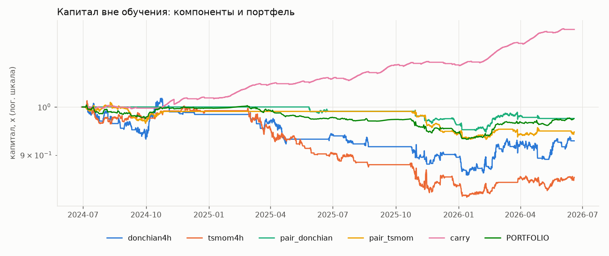

# Охота за доходностью: GRAM/TON perp (synthetic_null)

> **СИНТЕТИКА — проверка кода, не рынок.**

## 1. Компоненты (walk-forward, только вне обучения, после всех издержек)

Всего испытаний за проект (для DSR): **80** (включая 44 из run.py). White's Reality Check по всем 30 конфигурациям этого прогона: p = 0.330.

|  | CAGR | Sharpe | MaxDD | ProfitFactor | WinRate | Trades | TimeInMarket | Fees$ | Funding$ | Sharpe_CI_lo | DSR | DSR(var=1/T) | Random_p | MC_P(loss) |
|---|---|---|---|---|---|---|---|---|---|---|---|---|---|---|
| donchian4h | -0.037 | -0.414 | -0.155 | 0.819 | 0.315 | 73.000 | 0.407 | 102.881 | 73.683 | -1.488 | 0.000 | 0.001 | 0.775 | 0.727 |
| tsmom4h | -0.075 | -1.077 | -0.191 | 0.613 | 0.292 | 171.000 | 0.578 | 171.344 | 49.286 | -2.160 | 0.000 | 0.000 | 0.900 | 0.967 |
| pair_donchian | -0.013 | -0.509 | -0.054 | 0.648 | 0.357 | 14.000 | 0.180 | 23.287 | 43.372 | -1.610 | 0.000 | 0.000 | 0.600 | 0.783 |
| pair_tsmom | -0.027 | -0.882 | -0.078 | 0.642 | 0.295 | 95.000 | 0.382 | 136.703 | 23.400 | -2.092 | 0.000 | 0.000 | 0.500 | 0.923 |
| carry | 0.090 | 6.212 | -0.011 | — | — | 231.000 | — | — | — | 3.856 | 0.633 | 0.999 | — | — |

- **donchian4h: edge не доказан** — ✔ ≥30 сделок; ✘ Sharpe>0.5; ✘ DSR>0.95; ✘ RC p<0.05; ✘ лучше случайных; ✘ MC P(убыток)<20%

- **tsmom4h: edge не доказан** — ✔ ≥30 сделок; ✘ Sharpe>0.5; ✘ DSR>0.95; ✘ RC p<0.05; ✘ лучше случайных; ✘ MC P(убыток)<20%

- **pair_donchian: edge не доказан** — ✘ ≥30 сделок; ✘ Sharpe>0.5; ✘ DSR>0.95; ✘ RC p<0.05; ✘ лучше случайных; ✘ MC P(убыток)<20%

- **pair_tsmom: edge не доказан** — ✔ ≥30 сделок; ✘ Sharpe>0.5; ✘ DSR>0.95; ✘ RC p<0.05; ✘ лучше случайных; ✘ MC P(убыток)<20%

- **carry: edge не доказан** — ✔ ≥30 сделок; ✔ Sharpe>0.5; ✘ DSR>0.95; ✘ RC p<0.05; ✔ лучше случайных; ✘ MC P(убыток)<20%

donchian4h: фолды

| fold | test_start | params | train_sharpe_robust | test_sharpe | test_trades |
|---|---|---|---|---|---|
| 0 | 2024-06-29 00:00:00+00:00 | {'n': 55, 'stop': 2.5, 'side': 'both'} | 1.464 | -2.623 | 6 |
| 1 | 2024-08-28 00:00:00+00:00 | {'n': 20, 'stop': 2.5, 'side': 'both'} | 0.851 | 2.649 | 11 |
| 2 | 2024-10-27 00:00:00+00:00 | {'n': 20, 'stop': 4.0, 'side': 'short_only'} | 0.734 | -3.209 | 5 |
| 3 | 2024-12-26 00:00:00+00:00 | — | -0.011 | — | 0 |
| 4 | 2025-02-24 00:00:00+00:00 | {'n': 55, 'stop': 2.5, 'side': 'both'} | 0.942 | -4.240 | 7 |
| 5 | 2025-04-25 00:00:00+00:00 | — | -0.553 | — | 0 |
| 6 | 2025-06-24 00:00:00+00:00 | {'n': 55, 'stop': 2.5, 'side': 'short_only'} | 0.478 | -1.901 | 4 |
| 7 | 2025-08-23 00:00:00+00:00 | — | -0.642 | — | 0 |
| 8 | 2025-10-22 00:00:00+00:00 | {'n': 20, 'stop': 2.5, 'side': 'both'} | 1.809 | -1.016 | 12 |
| 9 | 2025-12-30 00:00:00+00:00 | {'n': 20, 'stop': 2.5, 'side': 'both'} | 1.541 | 1.459 | 12 |
| 10 | 2026-02-28 00:00:00+00:00 | {'n': 20, 'stop': 2.5, 'side': 'both'} | 1.945 | -1.387 | 12 |
| 11 | 2026-04-29 00:00:00+00:00 | {'n': 20, 'stop': 2.5, 'side': 'short_only'} | 0.417 | 3.800 | 4 |

tsmom4h: фолды

| fold | test_start | params | train_sharpe_robust | test_sharpe | test_trades |
|---|---|---|---|---|---|
| 0 | 2024-06-29 00:00:00+00:00 | {'L': 126, 'stop': 5.0, 'side': 'both'} | 0.998 | -2.349 | 28 |
| 1 | 2024-08-28 00:00:00+00:00 | {'L': 42, 'stop': 5.0, 'side': 'short_only'} | 0.212 | 3.229 | 8 |
| 2 | 2024-10-27 00:00:00+00:00 | {'L': 42, 'stop': 3.0, 'side': 'short_only'} | 0.718 | 0.115 | 13 |
| 3 | 2024-12-26 00:00:00+00:00 | — | -0.067 | — | 0 |
| 4 | 2025-02-24 00:00:00+00:00 | {'L': 42, 'stop': 3.0, 'side': 'both'} | 1.662 | -3.766 | 38 |
| 5 | 2025-04-25 00:00:00+00:00 | {'L': 126, 'stop': 3.0, 'side': 'short_only'} | 0.661 | -4.557 | 9 |
| 6 | 2025-06-24 00:00:00+00:00 | {'L': 126, 'stop': 3.0, 'side': 'short_only'} | 0.468 | -2.439 | 11 |
| 7 | 2025-08-23 00:00:00+00:00 | — | -2.105 | — | 0 |
| 8 | 2025-10-22 00:00:00+00:00 | {'L': 42, 'stop': 3.0, 'side': 'both'} | 0.562 | -1.620 | 32 |
| 9 | 2025-12-30 00:00:00+00:00 | {'L': 42, 'stop': 5.0, 'side': 'both'} | 0.561 | 0.658 | 16 |
| 10 | 2026-02-28 00:00:00+00:00 | {'L': 126, 'stop': 5.0, 'side': 'both'} | 1.660 | -0.982 | 6 |
| 11 | 2026-04-29 00:00:00+00:00 | {'L': 126, 'stop': 5.0, 'side': 'short_only'} | 1.129 | 2.456 | 10 |

pair_donchian: фолды

| fold | test_start | params | train_sharpe_robust | test_sharpe | test_trades |
|---|---|---|---|---|---|
| 0 | 2024-06-29 00:00:00+00:00 | — | -1.220 | — | 0 |
| 1 | 2024-08-28 00:00:00+00:00 | — | -1.298 | — | 0 |
| 2 | 2024-10-27 00:00:00+00:00 | — | -2.184 | — | 0 |
| 3 | 2024-12-26 00:00:00+00:00 | — | -2.646 | — | 0 |
| 4 | 2025-02-24 00:00:00+00:00 | — | -2.748 | — | 0 |
| 5 | 2025-04-25 00:00:00+00:00 | {'n': 20, 'stop': 2.5, 'side': 'both'} | 0.254 | -1.924 | 2 |
| 6 | 2025-06-24 00:00:00+00:00 | — | -0.220 | — | 0 |
| 7 | 2025-08-23 00:00:00+00:00 | — | — | — | 0 |
| 8 | 2025-10-22 00:00:00+00:00 | {'n': 20, 'stop': 2.5, 'side': 'both'} | 1.452 | -3.947 | 6 |
| 9 | 2025-12-30 00:00:00+00:00 | {'n': 20, 'stop': 2.5, 'side': 'both'} | 0.975 | 2.212 | 3 |
| 10 | 2026-02-28 00:00:00+00:00 | {'n': 55, 'stop': 2.5, 'side': 'both'} | 0.781 | -0.905 | 3 |
| 11 | 2026-04-29 00:00:00+00:00 | — | -0.256 | — | 0 |

pair_tsmom: фолды

| fold | test_start | params | train_sharpe_robust | test_sharpe | test_trades |
|---|---|---|---|---|---|
| 0 | 2024-06-29 00:00:00+00:00 | {'L': 42, 'stop': 3.0, 'side': 'both'} | 0.328 | -0.031 | 22 |
| 1 | 2024-08-28 00:00:00+00:00 | {'L': 42, 'stop': 3.0, 'side': 'both'} | 0.751 | -1.346 | 24 |
| 2 | 2024-10-27 00:00:00+00:00 | — | -0.151 | — | 0 |
| 3 | 2024-12-26 00:00:00+00:00 | — | -0.748 | — | 0 |
| 4 | 2025-02-24 00:00:00+00:00 | — | -1.095 | — | 0 |
| 5 | 2025-04-25 00:00:00+00:00 | — | -0.516 | — | 0 |
| 6 | 2025-06-24 00:00:00+00:00 | — | -0.566 | — | 0 |
| 7 | 2025-08-23 00:00:00+00:00 | — | -0.962 | — | 0 |
| 8 | 2025-10-22 00:00:00+00:00 | {'L': 42, 'stop': 3.0, 'side': 'both'} | 1.815 | -5.398 | 26 |
| 9 | 2025-12-30 00:00:00+00:00 | {'L': 126, 'stop': 3.0, 'side': 'both'} | 0.664 | 1.449 | 11 |
| 10 | 2026-02-28 00:00:00+00:00 | {'L': 126, 'stop': 3.0, 'side': 'both'} | 1.080 | -0.538 | 10 |
| 11 | 2026-04-29 00:00:00+00:00 | {'L': 126, 'stop': 3.0, 'side': 'both'} | 0.350 | -0.991 | 2 |

**carry: фолды** (выбор порога funding на train)

| fold | test_start | params | train_sharpe |
|---|---|---|---|
| 0 | 2024-06-29 00:00:00+00:00 | {'thr_ann': 0.1, 'k': 3} | 0.740 |
| 1 | 2024-08-28 00:00:00+00:00 | {'thr_ann': 0.2, 'k': 3} | 1.269 |
| 2 | 2024-10-27 00:00:00+00:00 | {'thr_ann': 0.1, 'k': 9} | 1.621 |
| 3 | 2024-12-26 00:00:00+00:00 | {'thr_ann': 0.1, 'k': 9} | 2.648 |
| 4 | 2025-02-24 00:00:00+00:00 | {'thr_ann': 0.1, 'k': 9} | 4.968 |
| 5 | 2025-04-25 00:00:00+00:00 | {'thr_ann': 0.1, 'k': 9} | 5.453 |
| 6 | 2025-06-24 00:00:00+00:00 | {'thr_ann': 0.05, 'k': 9} | 10.569 |
| 7 | 2025-08-23 00:00:00+00:00 | {'thr_ann': 0.1, 'k': 9} | 7.012 |
| 8 | 2025-10-22 00:00:00+00:00 | {'thr_ann': 0.1, 'k': 9} | 8.546 |
| 9 | 2025-12-30 00:00:00+00:00 | {'thr_ann': 0.2, 'k': 3} | 6.446 |
| 10 | 2026-02-28 00:00:00+00:00 | {'thr_ann': 0.05, 'k': 9} | 8.981 |
| 11 | 2026-04-29 00:00:00+00:00 | {'thr_ann': 0.2, 'k': 3} | 12.640 |

## 2. Портфель (равные веса, заданы заранее)

|  | value |
|---|---|
| CAGR | -0.013 |
| Sharpe | -0.423 |
| Sharpe_CI90 | [-1.57; 0.89] |
| MaxDD | -0.072 |
| DSR | 0.000 |
| DSR(var=1/T) | 0.001 |
| P(Sharpe<=0) | 0.724 |

Корреляции компонентов (дневные доходности):

|  | donchian4h | tsmom4h | pair_donchian | pair_tsmom | carry |
|---|---|---|---|---|---|
| donchian4h | 1.000 | 0.455 | 0.197 | 0.322 | 0.019 |
| tsmom4h | 0.455 | 1.000 | 0.074 | 0.088 | 0.024 |
| pair_donchian | 0.197 | 0.074 | 1.000 | 0.304 | 0.065 |
| pair_tsmom | 0.322 | 0.088 | 0.304 | 1.000 | 0.087 |
| carry | 0.019 | 0.024 | 0.065 | 0.087 | 1.000 |

## 3. Плечо: сколько можно заработать и какой ценой

**PORTFOLIO** — Monte Carlo на 1 год (stationary bootstrap дневных доходностей вне обучения):

|  | median_1y | p05_1y | p95_1y | P(убыток) | P(просадка>50%) | P(разорение) |
|---|---|---|---|---|---|---|
| 1x | -0.014 | -0.061 | 0.043 | 0.666 | 0.000 | 0.000 |
| 2x | -0.028 | -0.119 | 0.087 | 0.671 | 0.000 | 0.000 |
| 3x | -0.044 | -0.175 | 0.132 | 0.673 | 0.000 | 0.000 |
| 5x | -0.076 | -0.278 | 0.224 | 0.683 | 0.000 | 0.000 |
| 10x | -0.166 | -0.493 | 0.469 | 0.707 | 0.110 | 0.000 |

Келли (доля капитала × плечо): полный -14.05, 90% CI [-55.10; 31.95]. Если нижняя граница ≤ 0 — оптимальное плечо статистически неотличимо от нуля, т.е. любое плечо — ставка на удачу.

**carry** — Monte Carlo на 1 год (stationary bootstrap дневных доходностей вне обучения):

|  | median_1y | p05_1y | p95_1y | P(убыток) | P(просадка>50%) | P(разорение) |
|---|---|---|---|---|---|---|
| 1x | 0.089 | 0.048 | 0.137 | 0.000 | 0.000 | 0.000 |
| 2x | 0.186 | 0.098 | 0.294 | 0.000 | 0.000 | 0.000 |
| 3x | 0.291 | 0.150 | 0.471 | 0.001 | 0.000 | 0.000 |
| 5x | 0.529 | 0.261 | 0.900 | 0.001 | 0.000 | 0.000 |
| 10x | 1.325 | 0.582 | 2.585 | 0.001 | 0.000 | 0.000 |

⚠️ Для carry таблица плеча НЕ годится: плечо здесь — это плечо шорт-ноги перпетуала, и при 10x рост цены на ~9% ликвидирует её (в мае 2026 GRAM вырос на 120% за неделю). Разумный предел — 2–3x с запасом маржи.

## 4. Шорт под анлок Believers Fund

Даты анлоков — допущение (якорь 22.09.2026 ± 30 дней), см. UNLOCK_* в hunt.py. Показаны ВСЕ 6 вариантов окна, без выбора лучшего:

|  | events | mean_net | hit_rate | t |
|---|---|---|---|---|
| (1, 1) | 8.000 | 0.048 | 0.750 | 1.879 |
| (1, 3) | 8.000 | 0.009 | 0.625 | 0.184 |
| (3, 1) | 8.000 | 0.097 | 0.875 | 2.432 |
| (3, 3) | 8.000 | 0.058 | 0.625 | 0.951 |
| (7, 1) | 8.000 | 0.113 | 0.875 | 2.260 |
| (7, 3) | 8.000 | 0.077 | 0.625 | 1.189 |

Контроль тренда — тот же шорт в случайные даты того же периода (без funding). Эффект анлока есть, только если excess > 0 и p_bonferroni < 0.05 (поправка на 6 окон; на случайных данных без поправки ложные «находки» появляются регулярно):

|  | events | mean_net_unlock | mean_net_random_dates | excess | p_perm | p_bonferroni |
|---|---|---|---|---|---|---|
| (1, 1) | 8.000 | 0.048 | 0.012 | 0.036 | 0.080 | 0.480 |
| (1, 3) | 8.000 | 0.009 | 0.025 | -0.016 | 0.677 | 1.000 |
| (3, 1) | 8.000 | 0.097 | 0.025 | 0.072 | 0.027 | 0.160 |
| (3, 3) | 8.000 | 0.058 | 0.037 | 0.021 | 0.317 | 1.000 |
| (7, 1) | 8.000 | 0.113 | 0.050 | 0.064 | 0.077 | 0.460 |
| (7, 3) | 8.000 | 0.077 | 0.061 | 0.016 | 0.367 | 1.000 |

по событиям

| unlock | d_before | a_after | gross | funding | net |
|---|---|---|---|---|---|
| 2025-10-27 | 1.000 | 1.000 | -0.020 | -0.001 | -0.022 |
| 2025-10-27 | 1.000 | 3.000 | 0.146 | -0.003 | 0.142 |
| 2025-10-27 | 3.000 | 1.000 | 0.048 | -0.001 | 0.045 |
| 2025-10-27 | 3.000 | 3.000 | 0.203 | -0.003 | 0.198 |
| 2025-10-27 | 7.000 | 1.000 | -0.023 | 0.001 | -0.023 |
| 2025-10-27 | 7.000 | 3.000 | 0.144 | -0.000 | 0.142 |
| 2025-11-26 | 1.000 | 1.000 | 0.171 | -0.001 | 0.169 |
| 2025-11-26 | 1.000 | 3.000 | 0.151 | -0.001 | 0.148 |
| 2025-11-26 | 3.000 | 1.000 | 0.295 | -0.001 | 0.293 |
| 2025-11-26 | 3.000 | 3.000 | 0.277 | -0.001 | 0.274 |
| 2025-11-26 | 7.000 | 1.000 | 0.341 | -0.001 | 0.338 |
| 2025-11-26 | 7.000 | 3.000 | 0.324 | -0.002 | 0.321 |
| 2025-12-26 | 1.000 | 1.000 | 0.018 | -0.000 | 0.017 |
| 2025-12-26 | 1.000 | 3.000 | 0.017 | -0.000 | 0.015 |
| 2025-12-26 | 3.000 | 1.000 | 0.061 | -0.000 | 0.059 |
| 2025-12-26 | 3.000 | 3.000 | 0.059 | -0.000 | 0.057 |
| 2025-12-26 | 7.000 | 1.000 | 0.010 | 0.001 | 0.009 |
| 2025-12-26 | 7.000 | 3.000 | 0.008 | 0.000 | 0.007 |
| 2026-01-25 | 1.000 | 1.000 | 0.033 | -0.002 | 0.030 |
| 2026-01-25 | 1.000 | 3.000 | 0.032 | -0.003 | 0.028 |
| 2026-01-25 | 3.000 | 1.000 | 0.045 | -0.003 | 0.040 |
| 2026-01-25 | 3.000 | 3.000 | 0.044 | -0.004 | 0.038 |
| 2026-01-25 | 7.000 | 1.000 | 0.033 | -0.004 | 0.028 |
| 2026-01-25 | 7.000 | 3.000 | 0.032 | -0.005 | 0.026 |
| 2026-02-24 | 1.000 | 1.000 | 0.140 | 0.003 | 0.142 |
| 2026-02-24 | 1.000 | 3.000 | 0.148 | 0.006 | 0.153 |
| 2026-02-24 | 3.000 | 1.000 | 0.245 | 0.007 | 0.250 |
| 2026-02-24 | 3.000 | 3.000 | 0.252 | 0.009 | 0.260 |
| 2026-02-24 | 7.000 | 1.000 | 0.322 | 0.013 | 0.333 |
| 2026-02-24 | 7.000 | 3.000 | 0.328 | 0.016 | 0.342 |
| 2026-03-26 | 1.000 | 1.000 | 0.050 | 0.000 | 0.049 |
| 2026-03-26 | 1.000 | 3.000 | -0.208 | -0.000 | -0.210 |
| 2026-03-26 | 3.000 | 1.000 | 0.090 | 0.001 | 0.089 |
| 2026-03-26 | 3.000 | 3.000 | -0.157 | 0.000 | -0.159 |
| 2026-03-26 | 7.000 | 1.000 | 0.057 | 0.004 | 0.060 |
| 2026-03-26 | 7.000 | 3.000 | -0.199 | 0.003 | -0.198 |
| 2026-04-25 | 1.000 | 1.000 | 0.037 | 0.003 | 0.039 |
| 2026-04-25 | 1.000 | 3.000 | -0.058 | 0.006 | -0.054 |
| 2026-04-25 | 3.000 | 1.000 | -0.019 | 0.007 | -0.013 |
| 2026-04-25 | 3.000 | 3.000 | -0.119 | 0.009 | -0.111 |
| 2026-04-25 | 7.000 | 1.000 | 0.064 | 0.012 | 0.074 |
| 2026-04-25 | 7.000 | 3.000 | -0.029 | 0.015 | -0.015 |
| 2026-05-25 | 1.000 | 1.000 | -0.037 | 0.002 | -0.036 |
| 2026-05-25 | 1.000 | 3.000 | -0.151 | 0.004 | -0.149 |
| 2026-05-25 | 3.000 | 1.000 | 0.010 | 0.003 | 0.012 |
| 2026-05-25 | 3.000 | 3.000 | -0.099 | 0.005 | -0.095 |
| 2026-05-25 | 7.000 | 1.000 | 0.085 | 0.004 | 0.088 |
| 2026-05-25 | 7.000 | 3.000 | -0.016 | 0.007 | -0.011 |

## 5. Что система делает прямо сейчас

|  | вход сейчас | в позиции | позиция | стоп | параметры | edge доказан |
|---|---|---|---|---|---|---|
| donchian4h | нет | False | "" | None | {"n": 20, "stop": 2.5, "side": "short_only"} | False |
| tsmom4h | нет | True | {"side": "SHORT", "entry": 0.6979008084691369, "entry_time": "2026-06-14 16:00:00+00:00"} | None | {"L": 126, "stop": 5.0, "side": "short_only"} | False |
| pair_donchian | нет | True | {"side": "SHORT", "entry": 2.706648965108661e-05, "entry_time": "2026-04-26 00:00:00+00:00"} | None | {"n": 55, "stop": 2.5, "side": "both"} | False |
| pair_tsmom | нет | True | {"side": "SHORT", "entry": 2.0797754948830336e-05, "entry_time": "2026-06-14 16:00:00+00:00"} | None | {"L": 126, "stop": 3.0, "side": "both"} | False |
| carry | нет | True | funding (ann) = 16.4%, порог 20% | — | — | False |

## 6. Вердикт

**Ни один способ не прошёл все проверки.** Деньги на этих идеях заработать можно только случайно; плечо в такой ситуации ускоряет потерю, а не заработок.
