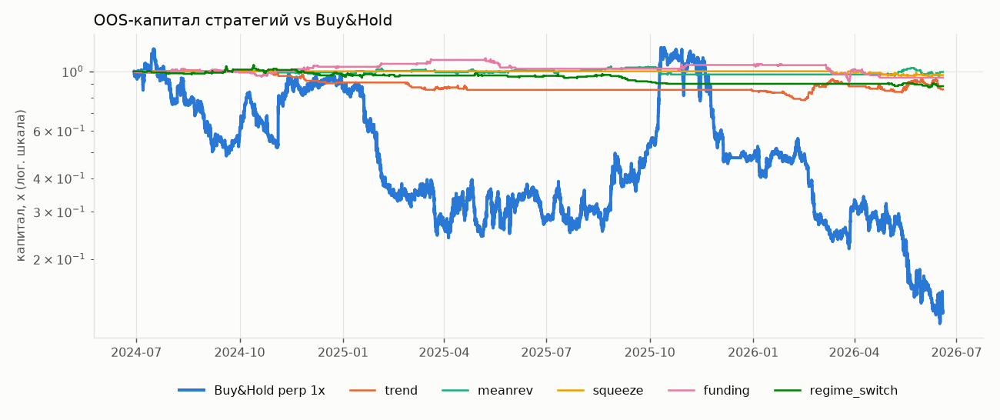
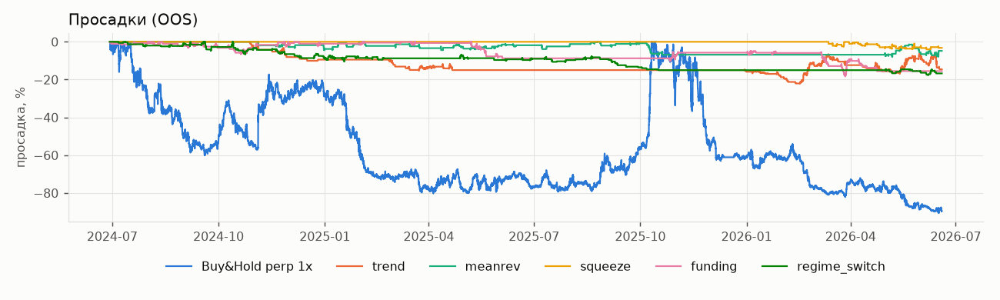
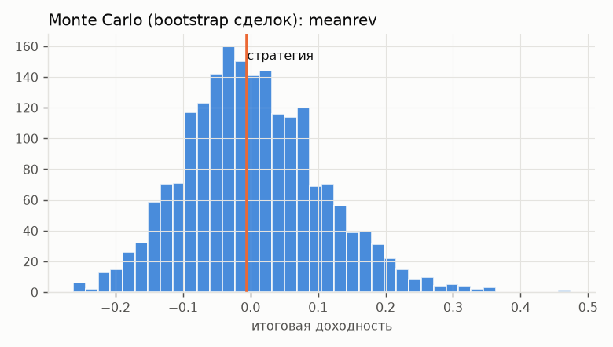
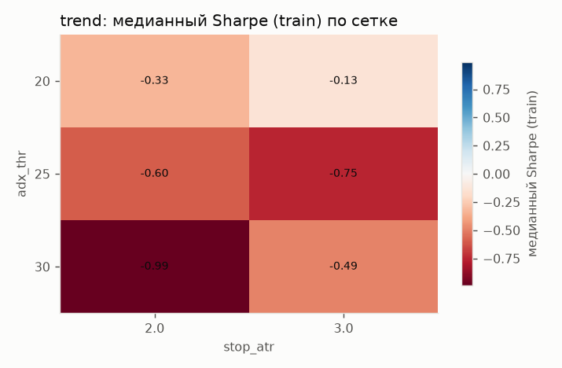
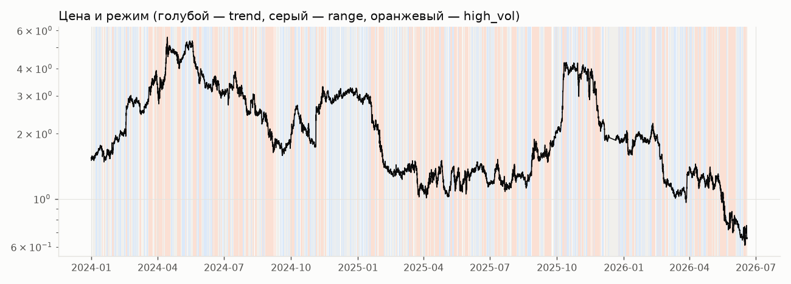
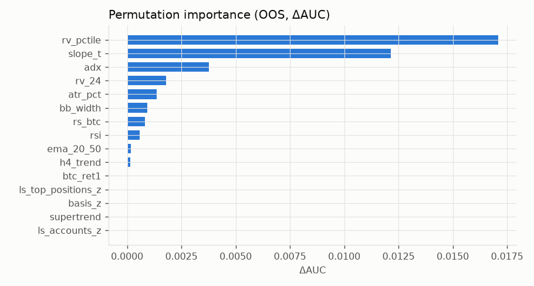
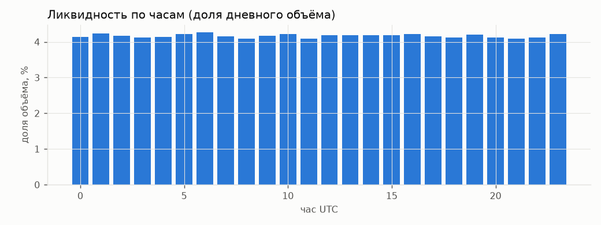

# TON/GRAM perpetual — исследовательский отчёт (synthetic_null)

> **ВНИМАНИЕ: СИНТЕТИЧЕСКИЕ ДАННЫЕ.** Этот отчёт проверяет сам фреймворк (контроль ложноположительных/мощности). Цифры НЕ относятся к рынку TON.

## 0. Данные и качество

Биржа: SYNTHETIC-null, ТФ 1h, период 2024-01-01 00:00:00+00:00 — 2026-06-18 23:00:00+00:00, сегменты: SYN_TON, SYN_GRAM. Funding: 2700 точек, OI/metrics: 21600 снимков.

|  | value |
|---|---|
| bars | 21384 |
| expected | 21600 |
| missing | 216 |
| gaps>1bar | 1 |
| duplicates | 0 |
| ohlc_violations | 0 |
| outliers(|z|>10 MAD) | 33 |
| zero_volume | 0 |

Разрывы (>1 бара): 2025-12-11 23:00:00+00:00 → 2025-12-21 00:00:00+00:00 (216 бар.)

## 1. Гипотеза H1 «нейтрально-положительный тренд»

Операционализация (заявлена до теста): подтверждена, если наклон лог-цены за 90 дней > 0 с HAC t > 1 **и** цена выше SMA200; опровергнута, если наклон < 0 с t < −1 **и** цена ниже SMA200.

|  | value |
|---|---|
| last_date | 2026-06-18 |
| last_close | 0.659 |
| ret_30d | -0.195 |
| range_30d | (0.6594985060959906, 0.8594148285670291) |
| pos_in_range_30d | 0.000 |
| slope_30d_pct_per_day | -0.573 |
| slope_30d_t | -4.809 |
| ret_90d | -0.373 |
| range_90d | (0.6594985060959906, 1.394118932680123) |
| pos_in_range_90d | 0.000 |
| slope_90d_pct_per_day | -0.790 |
| slope_90d_t | -6.440 |
| ret_365d | -0.524 |
| range_365d | (0.6594985060959906, 4.251940209081244) |
| pos_in_range_365d | 0.000 |
| slope_365d_pct_per_day | -0.143 |
| slope_365d_t | -3.094 |
| sma50 | 0.897 |
| sma200 | 1.439 |
| above_sma200 | False |
| sma50_gt_sma200 | False |
| verdict_H1 | ОПРОВЕРГНУТА |
| corr_btc_90d | 0.733 |
| beta_btc_90d | 1.171 |
| ton_vs_btc_90d | -0.183 |

Ключевые уровни (узлы объёмного профиля за 180 дн. + экстремумы 20/60 дн.):

|  | level | kind | weight | side |
|---|---|---|---|---|
| 0 | 2.0059 | volume node | 0.3206 | resistance |
| 1 | 1.9556 | volume node | 1.0000 | resistance |
| 2 | 1.8800 | volume node | 0.9319 | resistance |
| 3 | 1.4139 | 60d high | — | resistance |
| 4 | 1.3009 | volume node | 0.4626 | resistance |
| 5 | 1.2254 | volume node | 0.6907 | resistance |
| 6 | 1.0743 | volume node | 0.5191 | resistance |
| 7 | 0.8457 | 20d high | — | resistance |
| 8 | 0.5975 | 20d low | — | support |
| 9 | 0.5975 | 60d low | — | support |

## 2. Стратегии: walk-forward OOS (параметры выбраны только на train)

Окна: train 4320 бар., test 1440, шаг 1440. Издержки: taker 0.0500%, maker 0.0200%, проскальзывание 3.0 bps, funding — фактический. Риск/сделку 1.0%, плечо ≤ 3.0x, MMR 1.0%.

|  | CAGR | Sharpe | Sortino | Calmar | MaxDD | ProfitFactor | WinRate | AvgTrade% | Expectancy_R | tstat_R | Trades | MaxLosingStreak | TimeInMarket | Gross$ | Fees$ | Slippage$ | Funding$ | Net$ | Liquidations |
|---|---|---|---|---|---|---|---|---|---|---|---|---|---|---|---|---|---|---|---|
| Buy&Hold perp 1x | -0.649 | -0.290 | -0.457 | -0.716 | -0.906 | 0.000 | 0.000 | -0.628 | -0.628 | — | 2.000 | 2.000 | 1.000 | -7071.740 | 11.228 | 6.736 | -1643.343 | -8726.312 | 0.000 |
| trend | -0.076 | -0.667 | -0.555 | -0.341 | -0.221 | 0.667 | 0.100 | -0.011 | -0.276 | -0.727 | 50.000 | 11.000 | 0.160 | -1512.635 | 186.702 | 112.021 | 243.137 | -1456.201 | 0.000 |
| meanrev | -0.003 | -0.004 | -0.003 | -0.036 | -0.080 | 0.991 | 0.522 | -0.001 | -0.001 | -0.009 | 90.000 | 5.000 | 0.049 | 305.191 | 341.433 | 204.860 | -2.291 | -38.533 | 0.000 |
| squeeze | -0.016 | -0.459 | -0.241 | -0.408 | -0.040 | 0.727 | 0.419 | -0.007 | -0.102 | -0.687 | 31.000 | 3.000 | 0.016 | -234.219 | 89.136 | 53.482 | 1.919 | -321.436 | 0.000 |
| funding | -0.027 | -0.196 | -0.170 | -0.150 | -0.183 | 0.921 | 0.351 | 0.002 | -0.045 | -0.285 | 97.000 | 14.000 | 0.133 | -273.700 | 312.507 | 187.504 | 148.858 | -437.349 | 0.000 |
| regime_switch | -0.063 | -0.838 | -0.727 | -0.355 | -0.177 | 0.739 | 0.417 | -0.004 | -0.107 | -1.371 | 115.000 | 5.000 | 0.088 | -897.462 | 371.294 | 222.776 | 39.110 | -1229.646 | 0.000 |

*Gross$ — PnL по ценам исполнения (уже с проскальзыванием); Fees$ и Funding$ показывают, сколько «съели» комиссии и funding (Funding$ < 0 — уплачено).*

### 2.1 Фолды walk-forward

**trend**

| fold | train_start | test_start | test_end | params | train_sharpe_robust | test_sharpe | test_trades | note |
|---|---|---|---|---|---|---|---|---|
| 0 | 2024-01-01 00:00:00+00:00 | 2024-06-29 00:00:00+00:00 | 2024-08-27 23:00:00+00:00 | — | -0.701 | — | 0 | flat (no robust edge in train) |
| 1 | 2024-03-01 00:00:00+00:00 | 2024-08-28 00:00:00+00:00 | 2024-10-26 23:00:00+00:00 | — | -0.847 | — | 0 | flat (no robust edge in train) |
| 2 | 2024-04-30 00:00:00+00:00 | 2024-10-27 00:00:00+00:00 | 2024-12-25 23:00:00+00:00 | {'adx_thr': 20, 'stop_atr': 2.0, 'min_conf': 4} | 0.279 | -4.802 | 11 |  |
| 3 | 2024-06-29 00:00:00+00:00 | 2024-12-26 00:00:00+00:00 | 2025-02-23 23:00:00+00:00 | — | -0.029 | — | 0 | flat (no robust edge in train) |
| 4 | 2024-08-28 00:00:00+00:00 | 2025-02-24 00:00:00+00:00 | 2025-04-24 23:00:00+00:00 | {'adx_thr': 25, 'stop_atr': 2.0, 'min_conf': 2} | 0.381 | -3.062 | 9 |  |
| 5 | 2024-10-27 00:00:00+00:00 | 2025-04-25 00:00:00+00:00 | 2025-06-23 23:00:00+00:00 | — | -0.686 | — | 0 | flat (no robust edge in train) |
| 6 | 2024-12-26 00:00:00+00:00 | 2025-06-24 00:00:00+00:00 | 2025-08-22 23:00:00+00:00 | — | -0.563 | — | 0 | flat (no robust edge in train) |
| 7 | 2025-02-24 00:00:00+00:00 | 2025-08-23 00:00:00+00:00 | 2025-10-21 23:00:00+00:00 | — | -1.984 | — | 0 | flat (no robust edge in train) |
| 8 | 2025-04-25 00:00:00+00:00 | 2025-10-22 00:00:00+00:00 | 2025-12-29 23:00:00+00:00 | — | -2.114 | — | 0 | flat (no robust edge in train) |
| 9 | 2025-06-24 00:00:00+00:00 | 2025-12-30 00:00:00+00:00 | 2026-02-27 23:00:00+00:00 | {'adx_thr': 20, 'stop_atr': 3.0, 'min_conf': 4} | 0.123 | 1.538 | 10 |  |
| 10 | 2025-08-23 00:00:00+00:00 | 2026-02-28 00:00:00+00:00 | 2026-04-28 23:00:00+00:00 | {'adx_thr': 20, 'stop_atr': 2.0, 'min_conf': 4} | 1.277 | -1.368 | 11 |  |
| 11 | 2025-10-22 00:00:00+00:00 | 2026-04-29 00:00:00+00:00 | 2026-06-18 23:00:00+00:00 | {'adx_thr': 25, 'stop_atr': 2.0, 'min_conf': 4} | 1.257 | 0.481 | 9 |  |

**meanrev**

| fold | train_start | test_start | test_end | params | train_sharpe_robust | test_sharpe | test_trades | note |
|---|---|---|---|---|---|---|---|---|
| 0 | 2024-01-01 00:00:00+00:00 | 2024-06-29 00:00:00+00:00 | 2024-08-27 23:00:00+00:00 | — | -1.596 | — | 0 | flat (no robust edge in train) |
| 1 | 2024-03-01 00:00:00+00:00 | 2024-08-28 00:00:00+00:00 | 2024-10-26 23:00:00+00:00 | — | -0.544 | — | 0 | flat (no robust edge in train) |
| 2 | 2024-04-30 00:00:00+00:00 | 2024-10-27 00:00:00+00:00 | 2024-12-25 23:00:00+00:00 | {'rsi_lo': 25, 'stop_atr': 1.5} | 0.458 | -0.863 | 7 |  |
| 3 | 2024-06-29 00:00:00+00:00 | 2024-12-26 00:00:00+00:00 | 2025-02-23 23:00:00+00:00 | {'rsi_lo': 25, 'stop_atr': 1.5} | 0.065 | 0.758 | 10 |  |
| 4 | 2024-08-28 00:00:00+00:00 | 2025-02-24 00:00:00+00:00 | 2025-04-24 23:00:00+00:00 | {'rsi_lo': 25, 'stop_atr': 1.5} | 0.904 | 0.822 | 7 |  |
| 5 | 2024-10-27 00:00:00+00:00 | 2025-04-25 00:00:00+00:00 | 2025-06-23 23:00:00+00:00 | {'rsi_lo': 30, 'stop_atr': 2.5} | 1.084 | -0.020 | 20 |  |
| 6 | 2024-12-26 00:00:00+00:00 | 2025-06-24 00:00:00+00:00 | 2025-08-22 23:00:00+00:00 | {'rsi_lo': 25, 'stop_atr': 2.5} | 0.171 | 1.756 | 6 |  |
| 7 | 2025-02-24 00:00:00+00:00 | 2025-08-23 00:00:00+00:00 | 2025-10-21 23:00:00+00:00 | {'rsi_lo': 25, 'stop_atr': 2.5} | 0.469 | -3.230 | 17 |  |
| 8 | 2025-04-25 00:00:00+00:00 | 2025-10-22 00:00:00+00:00 | 2025-12-29 23:00:00+00:00 | — | -1.378 | — | 0 | flat (no robust edge in train) |
| 9 | 2025-06-24 00:00:00+00:00 | 2025-12-30 00:00:00+00:00 | 2026-02-27 23:00:00+00:00 | — | -1.134 | — | 0 | flat (no robust edge in train) |
| 10 | 2025-08-23 00:00:00+00:00 | 2026-02-28 00:00:00+00:00 | 2026-04-28 23:00:00+00:00 | — | -1.511 | — | 0 | flat (no robust edge in train) |
| 11 | 2025-10-22 00:00:00+00:00 | 2026-04-29 00:00:00+00:00 | 2026-06-18 23:00:00+00:00 | {'rsi_lo': 30, 'stop_atr': 1.5} | 0.690 | 1.037 | 23 |  |

**squeeze**

| fold | train_start | test_start | test_end | params | train_sharpe_robust | test_sharpe | test_trades | note |
|---|---|---|---|---|---|---|---|---|
| 0 | 2024-01-01 00:00:00+00:00 | 2024-06-29 00:00:00+00:00 | 2024-08-27 23:00:00+00:00 | — | -2.142 | — | 0 | flat (no robust edge in train) |
| 1 | 2024-03-01 00:00:00+00:00 | 2024-08-28 00:00:00+00:00 | 2024-10-26 23:00:00+00:00 | — | -0.878 | — | 0 | flat (no robust edge in train) |
| 2 | 2024-04-30 00:00:00+00:00 | 2024-10-27 00:00:00+00:00 | 2024-12-25 23:00:00+00:00 | — | -0.081 | — | 0 | flat (no robust edge in train) |
| 3 | 2024-06-29 00:00:00+00:00 | 2024-12-26 00:00:00+00:00 | 2025-02-23 23:00:00+00:00 | — | -0.677 | — | 0 | flat (no robust edge in train) |
| 4 | 2024-08-28 00:00:00+00:00 | 2025-02-24 00:00:00+00:00 | 2025-04-24 23:00:00+00:00 | — | -1.191 | — | 0 | flat (no robust edge in train) |
| 5 | 2024-10-27 00:00:00+00:00 | 2025-04-25 00:00:00+00:00 | 2025-06-23 23:00:00+00:00 | — | -1.521 | — | 0 | flat (no robust edge in train) |
| 6 | 2024-12-26 00:00:00+00:00 | 2025-06-24 00:00:00+00:00 | 2025-08-22 23:00:00+00:00 | — | -0.661 | — | 0 | flat (no robust edge in train) |
| 7 | 2025-02-24 00:00:00+00:00 | 2025-08-23 00:00:00+00:00 | 2025-10-21 23:00:00+00:00 | — | -1.631 | — | 0 | flat (no robust edge in train) |
| 8 | 2025-04-25 00:00:00+00:00 | 2025-10-22 00:00:00+00:00 | 2025-12-29 23:00:00+00:00 | — | -2.172 | — | 0 | flat (no robust edge in train) |
| 9 | 2025-06-24 00:00:00+00:00 | 2025-12-30 00:00:00+00:00 | 2026-02-27 23:00:00+00:00 | — | -0.860 | — | 0 | flat (no robust edge in train) |
| 10 | 2025-08-23 00:00:00+00:00 | 2026-02-28 00:00:00+00:00 | 2026-04-28 23:00:00+00:00 | {'hold': 12, 'stop_atr': 2.5} | 0.857 | -1.928 | 16 |  |
| 11 | 2025-10-22 00:00:00+00:00 | 2026-04-29 00:00:00+00:00 | 2026-06-18 23:00:00+00:00 | {'hold': 12, 'stop_atr': 2.5} | 0.278 | -0.220 | 15 |  |

**funding**

| fold | train_start | test_start | test_end | params | train_sharpe_robust | test_sharpe | test_trades | note |
|---|---|---|---|---|---|---|---|---|
| 0 | 2024-01-01 00:00:00+00:00 | 2024-06-29 00:00:00+00:00 | 2024-08-27 23:00:00+00:00 | {'z_thr': 1.5, 'hold': 48, 'stop_atr': 3.0} | 0.184 | 0.448 | 9 |  |
| 1 | 2024-03-01 00:00:00+00:00 | 2024-08-28 00:00:00+00:00 | 2024-10-26 23:00:00+00:00 | {'z_thr': 1.5, 'hold': 48, 'stop_atr': 3.0} | 0.811 | -0.663 | 15 |  |
| 2 | 2024-04-30 00:00:00+00:00 | 2024-10-27 00:00:00+00:00 | 2024-12-25 23:00:00+00:00 | {'z_thr': 1.5, 'hold': 24, 'stop_atr': 3.0} | 1.016 | 2.746 | 16 |  |
| 3 | 2024-06-29 00:00:00+00:00 | 2024-12-26 00:00:00+00:00 | 2025-02-23 23:00:00+00:00 | {'z_thr': 2.0, 'hold': 48, 'stop_atr': 2.0} | 1.223 | 3.072 | 3 |  |
| 4 | 2024-08-28 00:00:00+00:00 | 2025-02-24 00:00:00+00:00 | 2025-04-24 23:00:00+00:00 | {'z_thr': 2.0, 'hold': 24, 'stop_atr': 2.0} | 1.621 | 4.318 | 5 |  |
| 5 | 2024-10-27 00:00:00+00:00 | 2025-04-25 00:00:00+00:00 | 2025-06-23 23:00:00+00:00 | {'z_thr': 2.0, 'hold': 48, 'stop_atr': 2.0} | 2.262 | -4.363 | 9 |  |
| 6 | 2024-12-26 00:00:00+00:00 | 2025-06-24 00:00:00+00:00 | 2025-08-22 23:00:00+00:00 | — | -1.009 | — | 0 | flat (no robust edge in train) |
| 7 | 2025-02-24 00:00:00+00:00 | 2025-08-23 00:00:00+00:00 | 2025-10-21 23:00:00+00:00 | — | -1.379 | — | 0 | flat (no robust edge in train) |
| 8 | 2025-04-25 00:00:00+00:00 | 2025-10-22 00:00:00+00:00 | 2025-12-29 23:00:00+00:00 | {'z_thr': 1.5, 'hold': 24, 'stop_atr': 2.0} | 1.148 | 1.868 | 9 |  |
| 9 | 2025-06-24 00:00:00+00:00 | 2025-12-30 00:00:00+00:00 | 2026-02-27 23:00:00+00:00 | {'z_thr': 2.0, 'hold': 24, 'stop_atr': 3.0} | 2.765 | -0.110 | 9 |  |
| 10 | 2025-08-23 00:00:00+00:00 | 2026-02-28 00:00:00+00:00 | 2026-04-28 23:00:00+00:00 | {'z_thr': 1.5, 'hold': 48, 'stop_atr': 2.0} | 2.461 | -2.440 | 22 |  |
| 11 | 2025-10-22 00:00:00+00:00 | 2026-04-29 00:00:00+00:00 | 2026-06-18 23:00:00+00:00 | — | -0.922 | — | 0 | flat (no robust edge in train) |

**regime_switch**

| fold | train_start | test_start | test_end | params | train_sharpe_robust | test_sharpe | test_trades | note |
|---|---|---|---|---|---|---|---|---|
| 0 | 2024-01-01 00:00:00+00:00 | 2024-06-29 00:00:00+00:00 | 2024-08-27 23:00:00+00:00 | {'adx_thr': 25, 'stop_atr': 3.0, 'min_conf': 4, 'rsi_lo': 30} | 0.399 | -2.325 | 10 |  |
| 1 | 2024-03-01 00:00:00+00:00 | 2024-08-28 00:00:00+00:00 | 2024-10-26 23:00:00+00:00 | {'adx_thr': 20, 'stop_atr': 2.0, 'min_conf': 2, 'rsi_lo': 30} | 0.603 | 1.407 | 15 |  |
| 2 | 2024-04-30 00:00:00+00:00 | 2024-10-27 00:00:00+00:00 | 2024-12-25 23:00:00+00:00 | {'adx_thr': 25, 'stop_atr': 2.0, 'min_conf': 2, 'rsi_lo': 30} | 1.378 | -1.948 | 14 |  |
| 3 | 2024-06-29 00:00:00+00:00 | 2024-12-26 00:00:00+00:00 | 2025-02-23 23:00:00+00:00 | {'adx_thr': 25, 'stop_atr': 3.0, 'min_conf': 2, 'rsi_lo': 30} | 0.081 | -0.774 | 23 |  |
| 4 | 2024-08-28 00:00:00+00:00 | 2025-02-24 00:00:00+00:00 | 2025-04-24 23:00:00+00:00 | — | -0.532 | — | 0 | flat (no robust edge in train) |
| 5 | 2024-10-27 00:00:00+00:00 | 2025-04-25 00:00:00+00:00 | 2025-06-23 23:00:00+00:00 | {'adx_thr': 20, 'stop_atr': 3.0, 'min_conf': 4, 'rsi_lo': 30} | 0.651 | -0.827 | 8 |  |
| 6 | 2024-12-26 00:00:00+00:00 | 2025-06-24 00:00:00+00:00 | 2025-08-22 23:00:00+00:00 | {'adx_thr': 20, 'stop_atr': 3.0, 'min_conf': 4, 'rsi_lo': 30} | 0.358 | 1.584 | 12 |  |
| 7 | 2025-02-24 00:00:00+00:00 | 2025-08-23 00:00:00+00:00 | 2025-10-21 23:00:00+00:00 | {'adx_thr': 20, 'stop_atr': 3.0, 'min_conf': 4, 'rsi_lo': 30} | 0.882 | -8.469 | 16 |  |
| 8 | 2025-04-25 00:00:00+00:00 | 2025-10-22 00:00:00+00:00 | 2025-12-29 23:00:00+00:00 | — | -2.119 | — | 0 | flat (no robust edge in train) |
| 9 | 2025-06-24 00:00:00+00:00 | 2025-12-30 00:00:00+00:00 | 2026-02-27 23:00:00+00:00 | — | -0.063 | — | 0 | flat (no robust edge in train) |
| 10 | 2025-08-23 00:00:00+00:00 | 2026-02-28 00:00:00+00:00 | 2026-04-28 23:00:00+00:00 | — | -1.509 | — | 0 | flat (no robust edge in train) |
| 11 | 2025-10-22 00:00:00+00:00 | 2026-04-29 00:00:00+00:00 | 2026-06-18 23:00:00+00:00 | {'adx_thr': 25, 'stop_atr': 3.0, 'min_conf': 2, 'rsi_lo': 30} | 0.647 | -1.302 | 17 |  |

### 2.2 Разбивка по режимам и годам (OOS)

**trend** — по режиму на входе:

|  | Trades | WinRate | Net$ | ProfitFactor | Expectancy_R | Fees$ | Funding$ |
|---|---|---|---|---|---|---|---|
| high_vol | 16.000 | 0.125 | -167.565 | 0.866 | -0.098 | 38.058 | 50.958 |
| range | 21.000 | 0.143 | 10.116 | 1.006 | 0.051 | 94.365 | 150.394 |
| trend | 13.000 | 0.000 | -1298.752 | 0.000 | -1.022 | 54.279 | 41.784 |

**trend** — по годам:

|  | Trades | WinRate | Net$ | ProfitFactor | Expectancy_R | Fees$ | Funding$ | EquityReturn |
|---|---|---|---|---|---|---|---|---|
| 2024 | 11.000 | 0.091 | -916.802 | 0.062 | -0.869 | 57.503 | 46.045 | -0.092 |
| 2025 | 10.000 | 0.100 | -714.486 | 0.211 | -0.728 | 35.040 | 23.967 | -0.071 |
| 2026 | 29.000 | 0.103 | 175.087 | 1.070 | 0.105 | 94.160 | 173.125 | 0.015 |

**meanrev** — по режиму на входе:

|  | Trades | WinRate | Net$ | ProfitFactor | Expectancy_R | Fees$ | Funding$ |
|---|---|---|---|---|---|---|---|
| high_vol | 40.000 | 0.500 | 35.555 | 1.018 | 0.015 | 113.285 | -9.318 |
| range | 17.000 | 0.471 | -241.828 | 0.751 | -0.138 | 91.772 | -6.323 |
| trend | 33.000 | 0.576 | 167.741 | 1.145 | 0.051 | 136.377 | 13.351 |

**meanrev** — по годам:

|  | Trades | WinRate | Net$ | ProfitFactor | Expectancy_R | Fees$ | Funding$ | EquityReturn |
|---|---|---|---|---|---|---|---|---|
| 2024 | 10.000 | 0.500 | -295.288 | 0.454 | -0.294 | 61.335 | -8.136 | -0.029 |
| 2025 | 57.000 | 0.544 | 37.443 | 1.016 | 0.009 | 183.700 | 6.163 | 0.002 |
| 2026 | 23.000 | 0.478 | 219.312 | 1.184 | 0.102 | 96.398 | -0.318 | 0.022 |

**squeeze** — по режиму на входе:

|  | Trades | WinRate | Net$ | ProfitFactor | Expectancy_R | Fees$ | Funding$ |
|---|---|---|---|---|---|---|---|
| high_vol | 11.000 | 0.273 | -225.671 | 0.362 | -0.206 | 18.990 | 5.194 |
| range | 13.000 | 0.462 | -304.903 | 0.486 | -0.235 | 43.881 | -5.097 |
| trend | 7.000 | 0.571 | 209.137 | 1.903 | 0.310 | 26.265 | 1.823 |

**squeeze** — по годам:

|  | Trades | WinRate | Net$ | ProfitFactor | Expectancy_R | Fees$ | Funding$ | EquityReturn |
|---|---|---|---|---|---|---|---|---|
| 2024 | — | — | — | — | — | — | — | 0.000 |
| 2025 | — | — | — | — | — | — | — | 0.000 |
| 2026 | 31.000 | 0.419 | -321.436 | 0.727 | -0.102 | 89.136 | 1.919 | -0.032 |

**funding** — по режиму на входе:

|  | Trades | WinRate | Net$ | ProfitFactor | Expectancy_R | Fees$ | Funding$ |
|---|---|---|---|---|---|---|---|
| high_vol | 35.000 | 0.457 | 1200.106 | 1.765 | 0.371 | 70.130 | 48.254 |
| range | 32.000 | 0.406 | -121.089 | 0.926 | -0.048 | 125.643 | 52.416 |
| trend | 30.000 | 0.167 | -1516.365 | 0.340 | -0.526 | 116.734 | 48.188 |

**funding** — по годам:

|  | Trades | WinRate | Net$ | ProfitFactor | Expectancy_R | Fees$ | Funding$ | EquityReturn |
|---|---|---|---|---|---|---|---|---|
| 2024 | 41.000 | 0.463 | 395.622 | 1.219 | 0.101 | 117.943 | 96.882 | 0.039 |
| 2025 | 25.000 | 0.360 | 201.447 | 1.147 | 0.074 | 75.916 | 36.194 | 0.016 |
| 2026 | 31.000 | 0.194 | -1034.418 | 0.557 | -0.333 | 118.648 | 15.782 | -0.103 |

**regime_switch** — по режиму на входе:

|  | Trades | WinRate | Net$ | ProfitFactor | Expectancy_R | Fees$ | Funding$ |
|---|---|---|---|---|---|---|---|
| high_vol | 5.000 | 0.800 | 66.076 | 1.930 | 0.138 | 9.747 | 0.874 |
| range | 60.000 | 0.400 | -260.547 | 0.885 | -0.044 | 209.361 | -5.485 |
| trend | 50.000 | 0.400 | -1035.175 | 0.562 | -0.208 | 152.186 | 43.720 |

**regime_switch** — по годам:

|  | Trades | WinRate | Net$ | ProfitFactor | Expectancy_R | Fees$ | Funding$ | EquityReturn |
|---|---|---|---|---|---|---|---|---|
| 2024 | 42.000 | 0.429 | -319.336 | 0.824 | -0.075 | 168.802 | 8.960 | -0.039 |
| 2025 | 56.000 | 0.393 | -708.855 | 0.673 | -0.129 | 156.323 | 27.663 | -0.065 |
| 2026 | 17.000 | 0.471 | -201.454 | 0.721 | -0.116 | 46.168 | 2.486 | -0.020 |

## 3. Устойчивость и значимость

Всего испытано конфигураций: **44** (учтено в DSR и White's Reality Check).

|  | Sharpe_OOS | Sharpe_CI90_lo | Sharpe_CI90_hi | PSR(>0) | DSR | DSR(var=1/T) | SR0_ann(порог) | RC_p(vs cash) | RC_p(vs B&H) | MC_P(loss) | MC_ret_p05 | MC_ret_p95 | MC_maxDD_p05 | Random_p | Random_Sharpe_p50 |
|---|---|---|---|---|---|---|---|---|---|---|---|---|---|---|---|
| trend | -0.668 | -2.203 | 0.683 | 0.179 | 0.004 | 0.001 | 1.259 | 0.962 | 0.396 | 0.787 | -0.379 | 0.248 | -0.382 | 0.730 | -0.256 |
| meanrev | -0.004 | -1.145 | 1.046 | 0.498 | 0.038 | 0.013 | 1.259 | 0.962 | 0.396 | 0.516 | -0.151 | 0.166 | -0.184 | 0.300 | -0.418 |
| squeeze | -0.459 | -1.342 | 0.291 | 0.270 | 0.011 | 0.003 | 1.259 | 0.962 | 0.396 | 0.761 | -0.103 | 0.044 | -0.106 | 0.593 | -0.330 |
| funding | -0.196 | -1.433 | 0.913 | 0.394 | 0.023 | 0.007 | 1.259 | 0.962 | 0.396 | 0.644 | -0.240 | 0.216 | -0.274 | 0.440 | -0.296 |
| regime_switch | -0.838 | -1.925 | 0.033 | 0.130 | 0.002 | 0.001 | 1.259 | 0.962 | 0.396 | 0.918 | -0.249 | 0.023 | -0.264 | 0.713 | -0.454 |

Критерии edge (все обязательны):

- **trend: edge не найден** — ✔ OOS сделок >= 30; ✘ OOS Sharpe > 0.5 после издержек; ✘ Deflated Sharpe > 0.95; ✘ White's RC p < 0.05; ✘ Случайные входы p < 0.05; ✘ MC P(убыток) < 20%

- **meanrev: edge не найден** — ✔ OOS сделок >= 30; ✘ OOS Sharpe > 0.5 после издержек; ✘ Deflated Sharpe > 0.95; ✘ White's RC p < 0.05; ✘ Случайные входы p < 0.05; ✘ MC P(убыток) < 20%

- **squeeze: edge не найден** — ✔ OOS сделок >= 30; ✘ OOS Sharpe > 0.5 после издержек; ✘ Deflated Sharpe > 0.95; ✘ White's RC p < 0.05; ✘ Случайные входы p < 0.05; ✘ MC P(убыток) < 20%

- **funding: edge не найден** — ✔ OOS сделок >= 30; ✘ OOS Sharpe > 0.5 после издержек; ✘ Deflated Sharpe > 0.95; ✘ White's RC p < 0.05; ✘ Случайные входы p < 0.05; ✘ MC P(убыток) < 20%

- **regime_switch: edge не найден** — ✔ OOS сделок >= 30; ✘ OOS Sharpe > 0.5 после издержек; ✘ Deflated Sharpe > 0.95; ✘ White's RC p < 0.05; ✘ Случайные входы p < 0.05; ✘ MC P(убыток) < 20%

### 3.1 Чувствительность параметров (карта устойчивости)

**trend**: доля конфигураций с медианным train-Sharpe > 0: 0%; с OOS-Sharpe > 0: 50%

|  | adx_thr | stop_atr | min_conf | median_train_sharpe | share_folds_positive | median_oos_sharpe |
|---|---|---|---|---|---|---|
| 0 | 20.000 | 2.000 | 2.000 | -0.254 | 0.333 | 0.322 |
| 1 | 20.000 | 2.000 | 4.000 | -0.397 | 0.417 | -0.107 |
| 2 | 20.000 | 3.000 | 2.000 | -0.235 | 0.417 | 0.375 |
| 3 | 20.000 | 3.000 | 4.000 | -0.029 | 0.333 | 0.049 |
| 4 | 25.000 | 2.000 | 2.000 | -0.772 | 0.250 | 0.344 |
| 5 | 25.000 | 2.000 | 4.000 | -0.429 | 0.417 | 0.113 |
| 6 | 25.000 | 3.000 | 2.000 | -0.843 | 0.167 | 0.231 |
| 7 | 25.000 | 3.000 | 4.000 | -0.665 | 0.167 | -0.024 |
| 8 | 30.000 | 2.000 | 2.000 | -0.979 | 0.167 | -0.037 |
| 9 | 30.000 | 2.000 | 4.000 | -0.997 | 0.167 | -0.280 |
| 10 | 30.000 | 3.000 | 2.000 | -0.541 | 0.000 | -0.022 |
| 11 | 30.000 | 3.000 | 4.000 | -0.443 | 0.000 | -0.174 |

**meanrev**: доля конфигураций с медианным train-Sharpe > 0: 0%; с OOS-Sharpe > 0: 33%

|  | rsi_lo | stop_atr | median_train_sharpe | share_folds_positive | median_oos_sharpe |
|---|---|---|---|---|---|
| 0 | 25.000 | 1.500 | -0.239 | 0.417 | -0.153 |
| 1 | 25.000 | 2.500 | -0.231 | 0.500 | 0.064 |
| 2 | 30.000 | 1.500 | -1.723 | 0.250 | -0.683 |
| 3 | 30.000 | 2.500 | -0.491 | 0.417 | 0.190 |
| 4 | 35.000 | 1.500 | -1.945 | 0.083 | -1.791 |
| 5 | 35.000 | 2.500 | -1.358 | 0.083 | -1.020 |

**squeeze**: доля конфигураций с медианным train-Sharpe > 0: 0%; с OOS-Sharpe > 0: 0%

|  | hold | stop_atr | median_train_sharpe | share_folds_positive | median_oos_sharpe |
|---|---|---|---|---|---|
| 0 | 12.000 | 1.500 | -1.405 | 0.000 | -1.029 |
| 1 | 12.000 | 2.500 | -0.672 | 0.250 | -0.357 |
| 2 | 24.000 | 1.500 | -1.795 | 0.000 | -1.462 |
| 3 | 24.000 | 2.500 | -0.760 | 0.250 | -0.712 |
| 4 | 48.000 | 1.500 | -1.654 | 0.000 | -1.684 |
| 5 | 48.000 | 2.500 | -1.072 | 0.083 | -0.987 |

**funding**: доля конфигураций с медианным train-Sharpe > 0: 75%; с OOS-Sharpe > 0: 42%

|  | z_thr | hold | stop_atr | median_train_sharpe | share_folds_positive | median_oos_sharpe |
|---|---|---|---|---|---|---|
| 0 | 1.500 | 24.000 | 2.000 | 0.614 | 0.667 | -0.507 |
| 1 | 1.500 | 24.000 | 3.000 | 0.726 | 0.667 | -0.742 |
| 2 | 1.500 | 48.000 | 2.000 | 0.436 | 0.583 | -0.263 |
| 3 | 1.500 | 48.000 | 3.000 | 0.347 | 0.583 | -0.584 |
| 4 | 2.000 | 24.000 | 2.000 | 0.786 | 0.667 | 0.691 |
| 5 | 2.000 | 24.000 | 3.000 | 0.731 | 0.667 | 0.413 |
| 6 | 2.000 | 48.000 | 2.000 | 0.938 | 0.667 | 0.265 |
| 7 | 2.000 | 48.000 | 3.000 | 0.449 | 0.583 | -0.105 |
| 8 | 2.500 | 24.000 | 2.000 | 0.462 | 0.083 | -0.140 |
| 9 | 2.500 | 24.000 | 3.000 | — | 0.000 | -0.040 |
| 10 | 2.500 | 48.000 | 2.000 | — | 0.000 | 0.215 |
| 11 | 2.500 | 48.000 | 3.000 | — | 0.000 | 0.331 |

**regime_switch**: доля конфигураций с медианным train-Sharpe > 0: 25%; с OOS-Sharpe > 0: 25%

|  | adx_thr | stop_atr | min_conf | rsi_lo | median_train_sharpe | share_folds_positive | median_oos_sharpe |
|---|---|---|---|---|---|---|---|
| 0 | 20.000 | 2.000 | 2.000 | 30.000 | -0.652 | 0.333 | -0.517 |
| 1 | 20.000 | 2.000 | 4.000 | 30.000 | -1.045 | 0.167 | -0.679 |
| 2 | 20.000 | 3.000 | 2.000 | 30.000 | 0.374 | 0.750 | 0.187 |
| 3 | 20.000 | 3.000 | 4.000 | 30.000 | -0.273 | 0.417 | -0.436 |
| 4 | 25.000 | 2.000 | 2.000 | 30.000 | -0.751 | 0.333 | -0.440 |
| 5 | 25.000 | 2.000 | 4.000 | 30.000 | -1.290 | 0.083 | -0.791 |
| 6 | 25.000 | 3.000 | 2.000 | 30.000 | 0.262 | 0.667 | 0.209 |
| 7 | 25.000 | 3.000 | 4.000 | 30.000 | -0.131 | 0.417 | -0.520 |

Режимы (HMM обучен на первом train-окне, дальше — каузальная фильтрация): high_vol: 38%, range: 36%, trend: 26%

## 4. Нестандартные подходы (вердикт только по OOS)

**Funding как контрарный индикатор / «магниты» ликвидаций (прокси по OI):**

| hypothesis | horizon | IC_IS | t_IS | n_IS | IC_OOS | t_OOS | n_OOS | verdict |
|---|---|---|---|---|---|---|---|---|
| funding_z -> fwd ret (ожидаем IC<0) | 8 | -0.002 | -0.107 | 14817 | -0.024 | -0.775 | 6408 | НЕ подтверждено |
| funding_z -> fwd ret (ожидаем IC<0) | 24 | 0.009 | 0.275 | 14817 | -0.039 | -0.724 | 6392 | НЕ подтверждено |
| funding_z -> fwd ret (ожидаем IC<0) | 72 | 0.015 | 0.252 | 14817 | -0.126 | -1.306 | 6344 | НЕ подтверждено |
| liq_magnet -> fwd ret (ожидаем IC>0) | 8 | -0.020 | -1.155 | 14968 | 0.004 | 0.143 | 6408 | НЕ подтверждено |
| liq_magnet -> fwd ret (ожидаем IC>0) | 24 | -0.010 | -0.414 | 14968 | -0.001 | -0.034 | 6392 | НЕ подтверждено |

**OI + цена + объём (средняя доходность через 24 бара по квадрантам):**

| quadrant | sample | n | mean_fwd24_bps | t_naive | n_highvol | mean_fwd24_highvol_bps |
|---|---|---|---|---|---|---|
| цена↑ OI↑ (новые лонги) | IS | 3716 | -1.53 | -0.04 | 592 | -13.16 |
| цена↑ OI↑ (новые лонги) | OOS | 1537 | -3.71 | -0.05 | 237 | -9.82 |
| цена↑ OI↓ (закрытие шортов) | IS | 3714 | 7.43 | 0.18 | 575 | -11.46 |
| цена↑ OI↓ (закрытие шортов) | OOS | 1567 | -23.79 | -0.33 | 256 | 33.19 |
| цена↓ OI↑ (новые шорты) | IS | 3757 | 2.73 | 0.07 | 573 | 3.60 |
| цена↓ OI↑ (новые шорты) | OOS | 1692 | -60.48 | -0.88 | 274 | -54.11 |
| цена↓ OI↓ (закрытие лонгов) | IS | 3777 | -6.21 | -0.16 | 617 | -44.23 |
| цена↓ OI↓ (закрытие лонгов) | OOS | 1596 | -36.38 | -0.58 | 255 | 0.00 |

**Очистка шума: наклон EMA vs Калман vs вейвлет (IC со знаком будущей доходности 24 бара):**

| hypothesis | horizon | IC_IS | t_IS | n_IS | IC_OOS | t_OOS | n_OOS | verdict |
|---|---|---|---|---|---|---|---|---|
| EMA48 slope | 24 | 0.025 | 0.785 | 14967 | 0.076 | 0.991 | 6392 | НЕ подтверждено |
| Kalman slope (q/r=0.01) | 24 | 0.025 | 0.738 | 14968 | 0.051 | 0.657 | 6392 | НЕ подтверждено |
| Wavelet(db4,L3,128) slope | 24 | -0.002 | -0.204 | 14840 | 0.033 | 1.152 | 6392 | НЕ подтверждено |

_Lead-lag на синтетике считается на 1h (15m не генерируется)._

**Lead-lag BTC → TON:** кросс-корреляции r_TON(t) vs r_BTC(t−k):

|  | IS | OOS |
|---|---|---|
| 0 | 0.699 | 0.718 |
| 1 | -0.016 | 0.019 |
| 2 | -0.010 | 0.004 |
| 3 | -0.026 | -0.016 |
| 4 | -0.018 | 0.012 |

Lead-lag не выполнен: keys must be str, int, float, bool or None, not numpy.int64

**ML (HistGradientBoosting vs логит vs базовая частота), walk-forward c purge/embargo, OOS n=16676, доля «вверх» = 0.478:**

|  | AUC | LogLoss | Accuracy | trades(non-overlap) | mean_trade_bps_net | t_net |
|---|---|---|---|---|---|---|
| gb | 0.496 | 0.736 | 0.498 | 479.000 | -15.530 | -0.630 |
| logit | 0.504 | 0.710 | 0.503 | 361.000 | -7.153 | -0.262 |
| base_rate | 0.470 | 0.695 | 0.482 | 0.000 | — | — |

### 4.1 Специфика инструмента: часы ликвидности и скачки

Самые «тонкие» часы UTC (макс. Amihud): [7, 22, 15, 12] — в них проскальзывание стоит закладывать выше (CostModel.thin_hours).

|  | vol_share | abs_ret_bps | range_bps | amihud_rel |
|---|---|---|---|---|
| 0 | 0.041 | 67.226 | 146.743 | 0.962 |
| 1 | 0.042 | 68.990 | 148.348 | 1.008 |
| 2 | 0.042 | 68.637 | 150.216 | 0.996 |
| 3 | 0.041 | 66.522 | 145.669 | 0.982 |
| 4 | 0.041 | 69.478 | 152.227 | 1.003 |
| 5 | 0.042 | 69.193 | 151.558 | 1.005 |
| 6 | 0.043 | 68.035 | 147.453 | 1.001 |
| 7 | 0.042 | 72.454 | 153.560 | 1.043 |
| 8 | 0.041 | 72.797 | 152.858 | 0.999 |
| 9 | 0.042 | 68.485 | 148.470 | 1.005 |
| 10 | 0.042 | 68.489 | 147.039 | 0.993 |
| 11 | 0.041 | 68.467 | 146.768 | 0.995 |
| 12 | 0.042 | 69.191 | 149.883 | 1.028 |
| 13 | 0.042 | 68.488 | 147.360 | 0.973 |
| 14 | 0.042 | 68.877 | 145.000 | 1.003 |
| 15 | 0.042 | 72.256 | 147.955 | 1.033 |
| 16 | 0.042 | 69.075 | 145.798 | 1.021 |
| 17 | 0.041 | 67.400 | 144.469 | 0.993 |
| 18 | 0.041 | 64.505 | 142.056 | 0.937 |
| 19 | 0.042 | 67.549 | 143.396 | 0.994 |
| 20 | 0.041 | 66.852 | 141.811 | 0.989 |
| 21 | 0.041 | 69.097 | 148.499 | 0.991 |
| 22 | 0.041 | 71.916 | 150.009 | 1.042 |
| 23 | 0.042 | 71.226 | 151.588 | 1.025 |

Скачки |r| > 5σ: 93 (4.35 на 1000 баров при 0.0006 для нормального распределения); доля продолжения в течение 24 баров: 0.49.

## 5. Текущий сигнал

Стратегия с лучшим OOS Sharpe: **meanrev** (НЕ прошла критерии edge). Историческая OOS доля прибыльных сделок: 0.52, 90% CI Вильсона [0.44; 0.61] — это единственная честная «вероятность», которую даёт система.

> Стратегия не прошла валидацию → сигнал ниже **не является торгуемым**; показан для прозрачности.

|  | value |
|---|---|
| bar | 2026-06-18 23:00:00+00:00 |
| params | {"rsi_lo": 30, "stop_atr": 1.5} |
| regime_now | high_vol |
| confluence_now | -7.0000 |
| new_entry_signal | нет |
| strategy_in_position_now | False |
