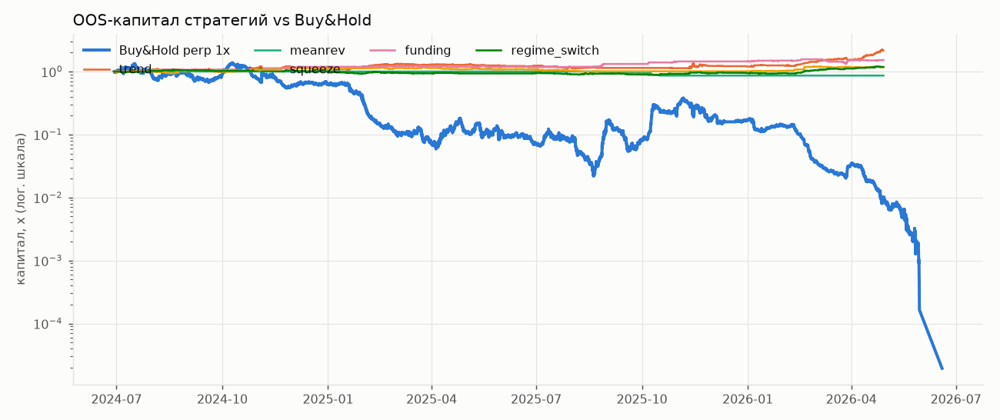
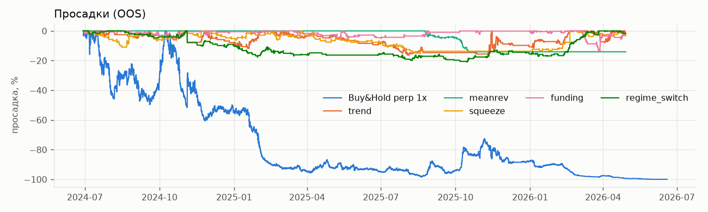
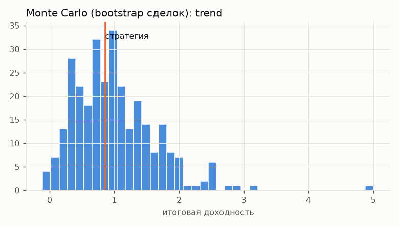
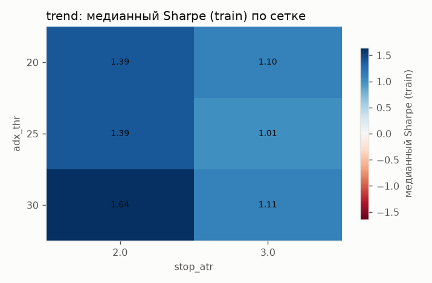
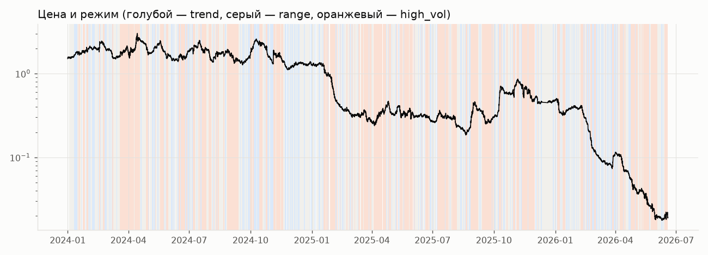
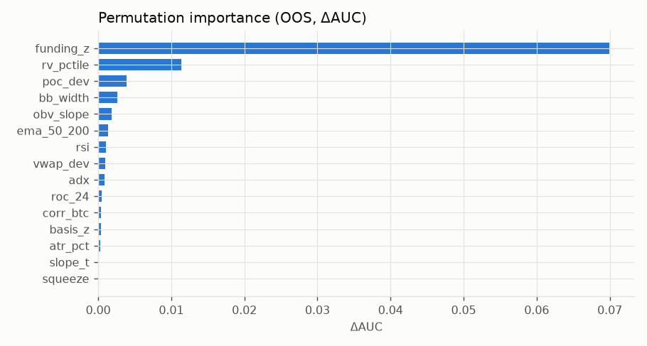
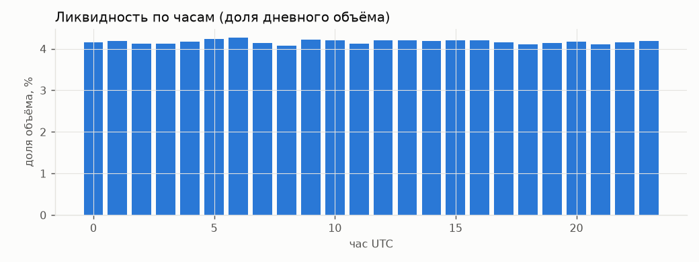

# TON/GRAM perpetual — исследовательский отчёт (synthetic_planted)

> **ВНИМАНИЕ: СИНТЕТИЧЕСКИЕ ДАННЫЕ.** Этот отчёт проверяет сам фреймворк (контроль ложноположительных/мощности). Цифры НЕ относятся к рынку TON.

## 0. Данные и качество

Биржа: SYNTHETIC-planted, ТФ 1h, период 2024-01-01 00:00:00+00:00 — 2026-06-18 23:00:00+00:00, сегменты: SYN_TON, SYN_GRAM. Funding: 2700 точек, OI/metrics: 21600 снимков.

|  | value |
|---|---|
| bars | 21384 |
| expected | 21600 |
| missing | 216 |
| gaps>1bar | 1 |
| duplicates | 0 |
| ohlc_violations | 0 |
| outliers(|z|>10 MAD) | 39 |
| zero_volume | 0 |

Разрывы (>1 бара): 2025-12-11 23:00:00+00:00 → 2025-12-21 00:00:00+00:00 (216 бар.)

## 1. Гипотеза H1 «нейтрально-положительный тренд»

Операционализация (заявлена до теста): подтверждена, если наклон лог-цены за 90 дней > 0 с HAC t > 1 **и** цена выше SMA200; опровергнута, если наклон < 0 с t < −1 **и** цена ниже SMA200.

|  | value |
|---|---|
| last_date | 2026-06-18 |
| last_close | 0.019 |
| ret_30d | -0.319 |
| range_30d | (0.017856069178154615, 0.027508180006946947) |
| pos_in_range_30d | 0.135 |
| slope_30d_pct_per_day | -1.113 |
| slope_30d_t | -2.905 |
| ret_90d | -0.763 |
| range_90d | (0.017856069178154615, 0.11399253642920609) |
| pos_in_range_90d | 0.014 |
| slope_90d_pct_per_day | -2.268 |
| slope_90d_t | -13.296 |
| ret_365d | -0.940 |
| range_365d | (0.017856069178154615, 0.846286146932405) |
| pos_in_range_365d | 0.002 |
| slope_365d_pct_per_day | -0.703 |
| slope_365d_t | -8.016 |
| sma50 | 0.028 |
| sma200 | 0.206 |
| above_sma200 | False |
| sma50_gt_sma200 | False |
| verdict_H1 | ОПРОВЕРГНУТА |
| corr_btc_90d | 0.628 |
| beta_btc_90d | 1.099 |
| ton_vs_btc_90d | -0.573 |

Ключевые уровни (узлы объёмного профиля за 180 дн. + экстремумы 20/60 дн.):

|  | level | kind | weight | side |
|---|---|---|---|---|
| 0 | 0.4864 | volume node | 0.3038 | resistance |
| 1 | 0.4624 | volume node | 1.0000 | resistance |
| 2 | 0.3983 | volume node | 0.7091 | resistance |
| 3 | 0.3823 | volume node | 0.9119 | resistance |
| 4 | 0.3343 | volume node | 0.5033 | resistance |
| 5 | 0.1022 | volume node | 0.3096 | resistance |
| 6 | 0.0692 | 60d high | — | resistance |
| 7 | 0.0226 | 20d high | — | resistance |
| 8 | 0.0177 | 20d low | — | support |
| 9 | 0.0177 | 60d low | — | support |

## 2. Стратегии: walk-forward OOS (параметры выбраны только на train)

Окна: train 4320 бар., test 1440, шаг 1440. Издержки: taker 0.0500%, maker 0.0200%, проскальзывание 3.0 bps, funding — фактический. Риск/сделку 1.0%, плечо ≤ 3.0x, MMR 1.0%.

|  | CAGR | Sharpe | Sortino | Calmar | MaxDD | ProfitFactor | WinRate | AvgTrade% | Expectancy_R | tstat_R | Trades | MaxLosingStreak | TimeInMarket | Gross$ | Fees$ | Slippage$ | Funding$ | Net$ | Liquidations |
|---|---|---|---|---|---|---|---|---|---|---|---|---|---|---|---|---|---|---|---|
| Buy&Hold perp 1x | -0.996 | -1.353 | -1.713 | -0.996 | -1.000 | 0.000 | 0.000 | -0.920 | -0.920 | — | 2.000 | 2.000 | 0.972 | -9070.878 | 7.053 | 4.231 | -921.875 | -9999.806 | 0.000 |
| trend | 0.518 | 2.024 | 2.077 | 3.151 | -0.164 | 2.947 | 0.262 | 0.041 | 1.372 | 2.154 | 61.000 | 15.000 | 0.466 | 8499.023 | 212.342 | 127.406 | 617.229 | 8903.911 | 0.000 |
| meanrev | -0.077 | -2.295 | -0.799 | -0.551 | -0.141 | 0.232 | 0.367 | -0.021 | -0.488 | -3.704 | 30.000 | 5.000 | 0.020 | -1278.326 | 81.974 | 49.184 | -11.156 | -1371.456 | 0.000 |
| squeeze | 0.091 | 0.633 | 1.040 | 0.592 | -0.153 | 1.257 | 0.399 | 0.001 | 0.123 | 0.918 | 143.000 | 9.000 | 0.102 | 2379.695 | 720.311 | 432.187 | 131.123 | 1790.506 | 0.000 |
| funding | 0.257 | 1.736 | 2.195 | 1.783 | -0.144 | 1.753 | 0.517 | 0.014 | 0.307 | 2.158 | 143.000 | 14.000 | 0.204 | 4653.675 | 423.936 | 254.362 | 216.297 | 4446.036 | 0.000 |
| regime_switch | 0.097 | 0.812 | 0.672 | 0.463 | -0.209 | 1.260 | 0.466 | 0.005 | 0.103 | 1.162 | 176.000 | 7.000 | 0.190 | 2197.882 | 599.821 | 359.893 | 256.813 | 1854.874 | 0.000 |

*Gross$ — PnL по ценам исполнения (уже с проскальзыванием); Fees$ и Funding$ показывают, сколько «съели» комиссии и funding (Funding$ < 0 — уплачено).*

### 2.1 Фолды walk-forward

**trend**

| fold | train_start | test_start | test_end | params | train_sharpe_robust | test_sharpe | test_trades | note |
|---|---|---|---|---|---|---|---|---|
| 0 | 2024-01-01 00:00:00+00:00 | 2024-06-29 00:00:00+00:00 | 2024-08-27 23:00:00+00:00 | {'adx_thr': 20, 'stop_atr': 2.0, 'min_conf': 4} | 1.425 | 2.436 | 3 |  |
| 1 | 2024-03-01 00:00:00+00:00 | 2024-08-28 00:00:00+00:00 | 2024-10-26 23:00:00+00:00 | {'adx_thr': 25, 'stop_atr': 3.0, 'min_conf': 2} | 2.343 | 2.285 | 7 |  |
| 2 | 2024-04-30 00:00:00+00:00 | 2024-10-27 00:00:00+00:00 | 2024-12-25 23:00:00+00:00 | {'adx_thr': 30, 'stop_atr': 2.0, 'min_conf': 2} | 1.871 | 0.149 | 4 |  |
| 3 | 2024-06-29 00:00:00+00:00 | 2024-12-26 00:00:00+00:00 | 2025-02-23 23:00:00+00:00 | {'adx_thr': 20, 'stop_atr': 2.0, 'min_conf': 2} | 1.650 | 4.259 | 10 |  |
| 4 | 2024-08-28 00:00:00+00:00 | 2025-02-24 00:00:00+00:00 | 2025-04-24 23:00:00+00:00 | {'adx_thr': 20, 'stop_atr': 3.0, 'min_conf': 4} | 2.729 | 0.201 | 7 |  |
| 5 | 2024-10-27 00:00:00+00:00 | 2025-04-25 00:00:00+00:00 | 2025-06-23 23:00:00+00:00 | {'adx_thr': 30, 'stop_atr': 2.0, 'min_conf': 4} | 1.503 | -3.210 | 5 |  |
| 6 | 2024-12-26 00:00:00+00:00 | 2025-06-24 00:00:00+00:00 | 2025-08-22 23:00:00+00:00 | {'adx_thr': 20, 'stop_atr': 2.0, 'min_conf': 2} | 1.309 | -2.296 | 10 |  |
| 7 | 2025-02-24 00:00:00+00:00 | 2025-08-23 00:00:00+00:00 | 2025-10-21 23:00:00+00:00 | — | -0.303 | — | 0 | flat (no robust edge in train) |
| 8 | 2025-04-25 00:00:00+00:00 | 2025-10-22 00:00:00+00:00 | 2025-12-29 23:00:00+00:00 | {'adx_thr': 30, 'stop_atr': 2.0, 'min_conf': 2} | 1.100 | 0.997 | 5 |  |
| 9 | 2025-06-24 00:00:00+00:00 | 2025-12-30 00:00:00+00:00 | 2026-02-27 23:00:00+00:00 | {'adx_thr': 20, 'stop_atr': 2.0, 'min_conf': 2} | 0.909 | 5.946 | 6 |  |
| 10 | 2025-08-23 00:00:00+00:00 | 2026-02-28 00:00:00+00:00 | 2026-04-28 23:00:00+00:00 | {'adx_thr': 20, 'stop_atr': 2.0, 'min_conf': 2} | 2.810 | 9.294 | 4 |  |

**meanrev**

| fold | train_start | test_start | test_end | params | train_sharpe_robust | test_sharpe | test_trades | note |
|---|---|---|---|---|---|---|---|---|
| 0 | 2024-01-01 00:00:00+00:00 | 2024-06-29 00:00:00+00:00 | 2024-08-27 23:00:00+00:00 | — | -0.931 | — | 0 | flat (no robust edge in train) |
| 1 | 2024-03-01 00:00:00+00:00 | 2024-08-28 00:00:00+00:00 | 2024-10-26 23:00:00+00:00 | — | -1.437 | — | 0 | flat (no robust edge in train) |
| 2 | 2024-04-30 00:00:00+00:00 | 2024-10-27 00:00:00+00:00 | 2024-12-25 23:00:00+00:00 | — | -0.992 | — | 0 | flat (no robust edge in train) |
| 3 | 2024-06-29 00:00:00+00:00 | 2024-12-26 00:00:00+00:00 | 2025-02-23 23:00:00+00:00 | — | -2.021 | — | 0 | flat (no robust edge in train) |
| 4 | 2024-08-28 00:00:00+00:00 | 2025-02-24 00:00:00+00:00 | 2025-04-24 23:00:00+00:00 | — | -2.413 | — | 0 | flat (no robust edge in train) |
| 5 | 2024-10-27 00:00:00+00:00 | 2025-04-25 00:00:00+00:00 | 2025-06-23 23:00:00+00:00 | — | -1.456 | — | 0 | flat (no robust edge in train) |
| 6 | 2024-12-26 00:00:00+00:00 | 2025-06-24 00:00:00+00:00 | 2025-08-22 23:00:00+00:00 | — | -1.141 | — | 0 | flat (no robust edge in train) |
| 7 | 2025-02-24 00:00:00+00:00 | 2025-08-23 00:00:00+00:00 | 2025-10-21 23:00:00+00:00 | {'rsi_lo': 30, 'stop_atr': 2.5} | 0.647 | -8.306 | 30 |  |
| 8 | 2025-04-25 00:00:00+00:00 | 2025-10-22 00:00:00+00:00 | 2025-12-29 23:00:00+00:00 | — | -0.961 | — | 0 | flat (no robust edge in train) |
| 9 | 2025-06-24 00:00:00+00:00 | 2025-12-30 00:00:00+00:00 | 2026-02-27 23:00:00+00:00 | — | -2.165 | — | 0 | flat (no robust edge in train) |
| 10 | 2025-08-23 00:00:00+00:00 | 2026-02-28 00:00:00+00:00 | 2026-04-28 23:00:00+00:00 | — | -5.061 | — | 0 | flat (no robust edge in train) |

**squeeze**

| fold | train_start | test_start | test_end | params | train_sharpe_robust | test_sharpe | test_trades | note |
|---|---|---|---|---|---|---|---|---|
| 0 | 2024-01-01 00:00:00+00:00 | 2024-06-29 00:00:00+00:00 | 2024-08-27 23:00:00+00:00 | {'hold': 48, 'stop_atr': 1.5} | 0.976 | 0.510 | 17 |  |
| 1 | 2024-03-01 00:00:00+00:00 | 2024-08-28 00:00:00+00:00 | 2024-10-26 23:00:00+00:00 | {'hold': 24, 'stop_atr': 1.5} | 1.022 | 1.015 | 15 |  |
| 2 | 2024-04-30 00:00:00+00:00 | 2024-10-27 00:00:00+00:00 | 2024-12-25 23:00:00+00:00 | {'hold': 24, 'stop_atr': 1.5} | 1.422 | 1.750 | 16 |  |
| 3 | 2024-06-29 00:00:00+00:00 | 2024-12-26 00:00:00+00:00 | 2025-02-23 23:00:00+00:00 | {'hold': 24, 'stop_atr': 1.5} | 1.328 | 0.228 | 17 |  |
| 4 | 2024-08-28 00:00:00+00:00 | 2025-02-24 00:00:00+00:00 | 2025-04-24 23:00:00+00:00 | {'hold': 24, 'stop_atr': 1.5} | 1.440 | -0.875 | 15 |  |
| 5 | 2024-10-27 00:00:00+00:00 | 2025-04-25 00:00:00+00:00 | 2025-06-23 23:00:00+00:00 | {'hold': 12, 'stop_atr': 1.5} | 1.276 | -0.053 | 15 |  |
| 6 | 2024-12-26 00:00:00+00:00 | 2025-06-24 00:00:00+00:00 | 2025-08-22 23:00:00+00:00 | {'hold': 12, 'stop_atr': 1.5} | 0.344 | -4.175 | 18 |  |
| 7 | 2025-02-24 00:00:00+00:00 | 2025-08-23 00:00:00+00:00 | 2025-10-21 23:00:00+00:00 | — | -1.075 | — | 0 | flat (no robust edge in train) |
| 8 | 2025-04-25 00:00:00+00:00 | 2025-10-22 00:00:00+00:00 | 2025-12-29 23:00:00+00:00 | — | -1.614 | — | 0 | flat (no robust edge in train) |
| 9 | 2025-06-24 00:00:00+00:00 | 2025-12-30 00:00:00+00:00 | 2026-02-27 23:00:00+00:00 | {'hold': 12, 'stop_atr': 1.5} | 0.233 | 4.158 | 12 |  |
| 10 | 2025-08-23 00:00:00+00:00 | 2026-02-28 00:00:00+00:00 | 2026-04-28 23:00:00+00:00 | {'hold': 12, 'stop_atr': 2.5} | 2.564 | -1.434 | 18 |  |

**funding**

| fold | train_start | test_start | test_end | params | train_sharpe_robust | test_sharpe | test_trades | note |
|---|---|---|---|---|---|---|---|---|
| 0 | 2024-01-01 00:00:00+00:00 | 2024-06-29 00:00:00+00:00 | 2024-08-27 23:00:00+00:00 | {'z_thr': 1.5, 'hold': 48, 'stop_atr': 3.0} | 4.373 | 3.995 | 9 |  |
| 1 | 2024-03-01 00:00:00+00:00 | 2024-08-28 00:00:00+00:00 | 2024-10-26 23:00:00+00:00 | {'z_thr': 1.5, 'hold': 24, 'stop_atr': 3.0} | 4.826 | -0.180 | 19 |  |
| 2 | 2024-04-30 00:00:00+00:00 | 2024-10-27 00:00:00+00:00 | 2024-12-25 23:00:00+00:00 | {'z_thr': 1.5, 'hold': 24, 'stop_atr': 3.0} | 4.520 | 5.308 | 17 |  |
| 3 | 2024-06-29 00:00:00+00:00 | 2024-12-26 00:00:00+00:00 | 2025-02-23 23:00:00+00:00 | {'z_thr': 1.5, 'hold': 24, 'stop_atr': 3.0} | 3.871 | 1.777 | 10 |  |
| 4 | 2024-08-28 00:00:00+00:00 | 2025-02-24 00:00:00+00:00 | 2025-04-24 23:00:00+00:00 | {'z_thr': 1.5, 'hold': 24, 'stop_atr': 3.0} | 3.672 | -2.099 | 11 |  |
| 5 | 2024-10-27 00:00:00+00:00 | 2025-04-25 00:00:00+00:00 | 2025-06-23 23:00:00+00:00 | {'z_thr': 1.5, 'hold': 48, 'stop_atr': 3.0} | 3.371 | -0.236 | 14 |  |
| 6 | 2024-12-26 00:00:00+00:00 | 2025-06-24 00:00:00+00:00 | 2025-08-22 23:00:00+00:00 | {'z_thr': 2.0, 'hold': 24, 'stop_atr': 3.0} | 1.942 | 1.239 | 7 |  |
| 7 | 2025-02-24 00:00:00+00:00 | 2025-08-23 00:00:00+00:00 | 2025-10-21 23:00:00+00:00 | {'z_thr': 2.0, 'hold': 24, 'stop_atr': 2.0} | 1.719 | 4.571 | 6 |  |
| 8 | 2025-04-25 00:00:00+00:00 | 2025-10-22 00:00:00+00:00 | 2025-12-29 23:00:00+00:00 | {'z_thr': 1.5, 'hold': 24, 'stop_atr': 3.0} | 4.997 | 2.571 | 7 |  |
| 9 | 2025-06-24 00:00:00+00:00 | 2025-12-30 00:00:00+00:00 | 2026-02-27 23:00:00+00:00 | {'z_thr': 1.5, 'hold': 24, 'stop_atr': 3.0} | 5.885 | 4.285 | 21 |  |
| 10 | 2025-08-23 00:00:00+00:00 | 2026-02-28 00:00:00+00:00 | 2026-04-28 23:00:00+00:00 | {'z_thr': 1.5, 'hold': 48, 'stop_atr': 2.0} | 5.746 | -0.465 | 22 |  |

**regime_switch**

| fold | train_start | test_start | test_end | params | train_sharpe_robust | test_sharpe | test_trades | note |
|---|---|---|---|---|---|---|---|---|
| 0 | 2024-01-01 00:00:00+00:00 | 2024-06-29 00:00:00+00:00 | 2024-08-27 23:00:00+00:00 | {'adx_thr': 20, 'stop_atr': 2.0, 'min_conf': 4, 'rsi_lo': 30} | 1.453 | 2.757 | 14 |  |
| 1 | 2024-03-01 00:00:00+00:00 | 2024-08-28 00:00:00+00:00 | 2024-10-26 23:00:00+00:00 | {'adx_thr': 20, 'stop_atr': 3.0, 'min_conf': 4, 'rsi_lo': 30} | 2.311 | -1.132 | 13 |  |
| 2 | 2024-04-30 00:00:00+00:00 | 2024-10-27 00:00:00+00:00 | 2024-12-25 23:00:00+00:00 | {'adx_thr': 25, 'stop_atr': 2.0, 'min_conf': 4, 'rsi_lo': 30} | 0.949 | -0.446 | 14 |  |
| 3 | 2024-06-29 00:00:00+00:00 | 2024-12-26 00:00:00+00:00 | 2025-02-23 23:00:00+00:00 | {'adx_thr': 20, 'stop_atr': 2.0, 'min_conf': 4, 'rsi_lo': 30} | 0.857 | -2.588 | 28 |  |
| 4 | 2024-08-28 00:00:00+00:00 | 2025-02-24 00:00:00+00:00 | 2025-04-24 23:00:00+00:00 | {'adx_thr': 20, 'stop_atr': 3.0, 'min_conf': 2, 'rsi_lo': 30} | 0.158 | -1.924 | 16 |  |
| 5 | 2024-10-27 00:00:00+00:00 | 2025-04-25 00:00:00+00:00 | 2025-06-23 23:00:00+00:00 | — | -0.306 | — | 0 | flat (no robust edge in train) |
| 6 | 2024-12-26 00:00:00+00:00 | 2025-06-24 00:00:00+00:00 | 2025-08-22 23:00:00+00:00 | {'adx_thr': 20, 'stop_atr': 3.0, 'min_conf': 2, 'rsi_lo': 30} | 0.268 | -0.448 | 23 |  |
| 7 | 2025-02-24 00:00:00+00:00 | 2025-08-23 00:00:00+00:00 | 2025-10-21 23:00:00+00:00 | {'adx_thr': 25, 'stop_atr': 3.0, 'min_conf': 2, 'rsi_lo': 30} | 0.584 | -1.068 | 12 |  |
| 8 | 2025-04-25 00:00:00+00:00 | 2025-10-22 00:00:00+00:00 | 2025-12-29 23:00:00+00:00 | {'adx_thr': 20, 'stop_atr': 3.0, 'min_conf': 2, 'rsi_lo': 30} | 1.021 | 2.291 | 15 |  |
| 9 | 2025-06-24 00:00:00+00:00 | 2025-12-30 00:00:00+00:00 | 2026-02-27 23:00:00+00:00 | {'adx_thr': 20, 'stop_atr': 3.0, 'min_conf': 2, 'rsi_lo': 30} | 0.459 | 5.364 | 22 |  |
| 10 | 2025-08-23 00:00:00+00:00 | 2026-02-28 00:00:00+00:00 | 2026-04-28 23:00:00+00:00 | {'adx_thr': 20, 'stop_atr': 3.0, 'min_conf': 2, 'rsi_lo': 30} | 1.877 | 6.288 | 19 |  |

### 2.2 Разбивка по режимам и годам (OOS)

**trend** — по режиму на входе:

|  | Trades | WinRate | Net$ | ProfitFactor | Expectancy_R | Fees$ | Funding$ |
|---|---|---|---|---|---|---|---|
| high_vol | 21.000 | 0.333 | 3493.855 | 3.433 | 1.715 | 44.795 | 161.456 |
| range | 25.000 | 0.160 | 1418.143 | 1.665 | 0.379 | 110.783 | 249.429 |
| trend | 15.000 | 0.333 | 3991.913 | 4.980 | 2.546 | 56.764 | 206.344 |

**trend** — по годам:

|  | Trades | WinRate | Net$ | ProfitFactor | Expectancy_R | Fees$ | Funding$ | EquityReturn |
|---|---|---|---|---|---|---|---|---|
| 2024 | 16.000 | 0.250 | 1051.564 | 1.854 | 0.685 | 56.687 | 122.393 | 0.106 |
| 2025 | 36.000 | 0.194 | 956.745 | 1.324 | 0.279 | 119.181 | 202.545 | 0.086 |
| 2026 | 9.000 | 0.556 | 6895.601 | 18.865 | 6.962 | 36.474 | 292.291 | 0.786 |

**meanrev** — по режиму на входе:

|  | Trades | WinRate | Net$ | ProfitFactor | Expectancy_R | Fees$ | Funding$ |
|---|---|---|---|---|---|---|---|
| high_vol | 16.000 | 0.500 | -424.052 | 0.397 | -0.278 | 33.395 | -3.328 |
| range | 6.000 | 0.167 | -438.473 | 0.114 | -0.789 | 22.605 | -3.803 |
| trend | 8.000 | 0.250 | -508.931 | 0.133 | -0.682 | 25.974 | -4.025 |

**meanrev** — по годам:

|  | Trades | WinRate | Net$ | ProfitFactor | Expectancy_R | Fees$ | Funding$ | EquityReturn |
|---|---|---|---|---|---|---|---|---|
| 2024 | — | — | — | — | — | — | — | 0.000 |
| 2025 | 30.000 | 0.367 | -1371.456 | 0.232 | -0.488 | 81.974 | -11.156 | -0.137 |
| 2026 | — | — | — | — | — | — | — | 0.000 |

**squeeze** — по режиму на входе:

|  | Trades | WinRate | Net$ | ProfitFactor | Expectancy_R | Fees$ | Funding$ |
|---|---|---|---|---|---|---|---|
| high_vol | 43.000 | 0.279 | -1030.756 | 0.577 | -0.233 | 129.133 | 19.498 |
| range | 68.000 | 0.471 | 1776.973 | 1.606 | 0.265 | 404.123 | 62.818 |
| trend | 32.000 | 0.406 | 1044.290 | 1.655 | 0.302 | 187.055 | 48.807 |

**squeeze** — по годам:

|  | Trades | WinRate | Net$ | ProfitFactor | Expectancy_R | Fees$ | Funding$ | EquityReturn |
|---|---|---|---|---|---|---|---|---|
| 2024 | 49.000 | 0.286 | 930.777 | 1.368 | 0.202 | 270.540 | 61.228 | 0.095 |
| 2025 | 64.000 | 0.375 | -800.507 | 0.766 | -0.123 | 316.170 | 30.275 | -0.079 |
| 2026 | 30.000 | 0.633 | 1660.236 | 2.642 | 0.521 | 133.601 | 39.619 | 0.162 |

**funding** — по режиму на входе:

|  | Trades | WinRate | Net$ | ProfitFactor | Expectancy_R | Fees$ | Funding$ |
|---|---|---|---|---|---|---|---|
| high_vol | 48.000 | 0.667 | 3151.407 | 3.281 | 0.685 | 93.585 | 71.895 |
| range | 37.000 | 0.568 | 1249.321 | 1.992 | 0.321 | 128.118 | 63.506 |
| trend | 58.000 | 0.362 | 45.308 | 1.014 | -0.014 | 202.233 | 80.896 |

**funding** — по годам:

|  | Trades | WinRate | Net$ | ProfitFactor | Expectancy_R | Fees$ | Funding$ | EquityReturn |
|---|---|---|---|---|---|---|---|---|
| 2024 | 46.000 | 0.522 | 1802.219 | 2.056 | 0.384 | 135.825 | 88.816 | 0.188 |
| 2025 | 54.000 | 0.611 | 2110.413 | 2.126 | 0.377 | 133.063 | 69.573 | 0.217 |
| 2026 | 43.000 | 0.395 | 533.405 | 1.230 | 0.137 | 155.048 | 57.908 | 0.051 |

**regime_switch** — по режиму на входе:

|  | Trades | WinRate | Net$ | ProfitFactor | Expectancy_R | Fees$ | Funding$ |
|---|---|---|---|---|---|---|---|
| high_vol | 9.000 | 0.222 | -311.581 | 0.212 | -0.327 | 23.673 | 0.412 |
| range | 70.000 | 0.529 | 457.827 | 1.192 | 0.064 | 261.126 | -8.969 |
| trend | 97.000 | 0.443 | 1708.628 | 1.391 | 0.170 | 315.023 | 265.370 |

**regime_switch** — по годам:

|  | Trades | WinRate | Net$ | ProfitFactor | Expectancy_R | Fees$ | Funding$ | EquityReturn |
|---|---|---|---|---|---|---|---|---|
| 2024 | 42.000 | 0.405 | 47.834 | 1.025 | 0.014 | 173.643 | 66.055 | 0.003 |
| 2025 | 94.000 | 0.426 | -592.625 | 0.857 | -0.061 | 301.281 | 95.316 | -0.061 |
| 2026 | 40.000 | 0.625 | 2399.665 | 3.137 | 0.580 | 124.897 | 95.442 | 0.256 |

## 3. Устойчивость и значимость

Всего испытано конфигураций: **44** (учтено в DSR и White's Reality Check).

|  | Sharpe_OOS | Sharpe_CI90_lo | Sharpe_CI90_hi | PSR(>0) | DSR | DSR(var=1/T) | SR0_ann(порог) | RC_p(vs cash) | RC_p(vs B&H) | MC_P(loss) | MC_ret_p05 | MC_ret_p95 | MC_maxDD_p05 | Random_p | Random_Sharpe_p50 |
|---|---|---|---|---|---|---|---|---|---|---|---|---|---|---|---|
| trend | 2.026 | 0.797 | 3.372 | 0.998 | 0.006 | 0.701 | 3.832 | 0.006 | 0.136 | 0.010 | 0.218 | 2.055 | -0.161 | 0.000 | 0.793 |
| meanrev | -2.297 | -3.504 | -0.954 | 0.000 | 0.000 | 0.000 | 3.832 | 0.006 | 0.136 | 0.997 | -0.192 | -0.082 | -0.190 | 1.000 | -0.031 |
| squeeze | 0.633 | -0.519 | 1.681 | 0.825 | 0.000 | 0.068 | 3.832 | 0.006 | 0.136 | 0.180 | -0.127 | 0.630 | -0.225 | 0.050 | -0.391 |
| funding | 1.737 | 0.641 | 2.734 | 0.998 | 0.000 | 0.561 | 3.832 | 0.006 | 0.136 | 0.017 | 0.110 | 0.801 | -0.111 | 0.000 | -0.218 |
| regime_switch | 0.813 | -0.344 | 2.275 | 0.855 | 0.000 | 0.139 | 3.832 | 0.006 | 0.136 | 0.150 | -0.111 | 0.509 | -0.196 | 0.125 | -0.186 |

Критерии edge (все обязательны):

- **trend: edge не найден** — ✔ OOS сделок >= 30; ✔ OOS Sharpe > 0.5 после издержек; ✘ Deflated Sharpe > 0.95; ✔ White's RC p < 0.05; ✔ Случайные входы p < 0.05; ✔ MC P(убыток) < 20%

- **meanrev: edge не найден** — ✔ OOS сделок >= 30; ✘ OOS Sharpe > 0.5 после издержек; ✘ Deflated Sharpe > 0.95; ✔ White's RC p < 0.05; ✘ Случайные входы p < 0.05; ✘ MC P(убыток) < 20%

- **squeeze: edge не найден** — ✔ OOS сделок >= 30; ✔ OOS Sharpe > 0.5 после издержек; ✘ Deflated Sharpe > 0.95; ✔ White's RC p < 0.05; ✘ Случайные входы p < 0.05; ✔ MC P(убыток) < 20%

- **funding: edge не найден** — ✔ OOS сделок >= 30; ✔ OOS Sharpe > 0.5 после издержек; ✘ Deflated Sharpe > 0.95; ✔ White's RC p < 0.05; ✔ Случайные входы p < 0.05; ✔ MC P(убыток) < 20%

- **regime_switch: edge не найден** — ✔ OOS сделок >= 30; ✔ OOS Sharpe > 0.5 после издержек; ✘ Deflated Sharpe > 0.95; ✔ White's RC p < 0.05; ✘ Случайные входы p < 0.05; ✔ MC P(убыток) < 20%

### 3.1 Чувствительность параметров (карта устойчивости)

**trend**: доля конфигураций с медианным train-Sharpe > 0: 100%; с OOS-Sharpe > 0: 100%

|  | adx_thr | stop_atr | min_conf | median_train_sharpe | share_folds_positive | median_oos_sharpe |
|---|---|---|---|---|---|---|
| 0 | 20.000 | 2.000 | 2.000 | 1.255 | 0.909 | 2.233 |
| 1 | 20.000 | 2.000 | 4.000 | 1.531 | 0.818 | 2.070 |
| 2 | 20.000 | 3.000 | 2.000 | 1.322 | 0.818 | 2.133 |
| 3 | 20.000 | 3.000 | 4.000 | 0.883 | 0.636 | 1.981 |
| 4 | 25.000 | 2.000 | 2.000 | 1.422 | 0.727 | 2.344 |
| 5 | 25.000 | 2.000 | 4.000 | 1.364 | 0.545 | 2.239 |
| 6 | 25.000 | 3.000 | 2.000 | 1.042 | 0.636 | 2.017 |
| 7 | 25.000 | 3.000 | 4.000 | 0.975 | 0.273 | 1.904 |
| 8 | 30.000 | 2.000 | 2.000 | 1.411 | 0.455 | 2.445 |
| 9 | 30.000 | 2.000 | 4.000 | 1.868 | 0.273 | 2.136 |
| 10 | 30.000 | 3.000 | 2.000 | 1.059 | 0.273 | 2.192 |
| 11 | 30.000 | 3.000 | 4.000 | 1.163 | 0.273 | 1.715 |

**meanrev**: доля конфигураций с медианным train-Sharpe > 0: 0%; с OOS-Sharpe > 0: 0%

|  | rsi_lo | stop_atr | median_train_sharpe | share_folds_positive | median_oos_sharpe |
|---|---|---|---|---|---|
| 0 | 25.000 | 1.500 | -2.280 | 0.000 | -2.797 |
| 1 | 25.000 | 2.500 | -1.437 | 0.000 | -1.758 |
| 2 | 30.000 | 1.500 | -2.012 | 0.091 | -2.205 |
| 3 | 30.000 | 2.500 | -1.413 | 0.182 | -1.764 |
| 4 | 35.000 | 1.500 | -3.896 | 0.000 | -3.871 |
| 5 | 35.000 | 2.500 | -3.410 | 0.000 | -3.397 |

**squeeze**: доля конфигураций с медианным train-Sharpe > 0: 100%; с OOS-Sharpe > 0: 100%

|  | hold | stop_atr | median_train_sharpe | share_folds_positive | median_oos_sharpe |
|---|---|---|---|---|---|
| 0 | 12.000 | 1.500 | 0.718 | 0.727 | 1.062 |
| 1 | 12.000 | 2.500 | 0.723 | 0.727 | 1.036 |
| 2 | 24.000 | 1.500 | 0.976 | 0.727 | 0.807 |
| 3 | 24.000 | 2.500 | 0.550 | 0.727 | 0.842 |
| 4 | 48.000 | 1.500 | 1.054 | 0.636 | 0.759 |
| 5 | 48.000 | 2.500 | 0.822 | 0.636 | 0.737 |

**funding**: доля конфигураций с медианным train-Sharpe > 0: 67%; с OOS-Sharpe > 0: 100%

|  | z_thr | hold | stop_atr | median_train_sharpe | share_folds_positive | median_oos_sharpe |
|---|---|---|---|---|---|---|
| 0 | 1.500 | 24.000 | 2.000 | 3.977 | 0.909 | 3.466 |
| 1 | 1.500 | 24.000 | 3.000 | 3.925 | 0.909 | 3.090 |
| 2 | 1.500 | 48.000 | 2.000 | 3.994 | 0.909 | 3.079 |
| 3 | 1.500 | 48.000 | 3.000 | 4.596 | 1.000 | 3.482 |
| 4 | 2.000 | 24.000 | 2.000 | 3.163 | 1.000 | 2.491 |
| 5 | 2.000 | 24.000 | 3.000 | 3.620 | 1.000 | 2.473 |
| 6 | 2.000 | 48.000 | 2.000 | 3.067 | 0.909 | 2.264 |
| 7 | 2.000 | 48.000 | 3.000 | 3.079 | 0.636 | 2.118 |
| 8 | 2.500 | 24.000 | 2.000 | — | 0.000 | 1.622 |
| 9 | 2.500 | 24.000 | 3.000 | — | 0.000 | 1.153 |
| 10 | 2.500 | 48.000 | 2.000 | — | 0.000 | 1.690 |
| 11 | 2.500 | 48.000 | 3.000 | — | 0.000 | 1.595 |

**regime_switch**: доля конфигураций с медианным train-Sharpe > 0: 75%; с OOS-Sharpe > 0: 100%

|  | adx_thr | stop_atr | min_conf | rsi_lo | median_train_sharpe | share_folds_positive | median_oos_sharpe |
|---|---|---|---|---|---|---|---|
| 0 | 20.000 | 2.000 | 2.000 | 30.000 | 0.615 | 0.545 | 1.211 |
| 1 | 20.000 | 2.000 | 4.000 | 30.000 | -0.068 | 0.455 | 0.624 |
| 2 | 20.000 | 3.000 | 2.000 | 30.000 | 0.735 | 0.909 | 1.203 |
| 3 | 20.000 | 3.000 | 4.000 | 30.000 | 0.558 | 0.818 | 0.951 |
| 4 | 25.000 | 2.000 | 2.000 | 30.000 | 0.466 | 0.636 | 1.282 |
| 5 | 25.000 | 2.000 | 4.000 | 30.000 | -0.107 | 0.455 | 0.643 |
| 6 | 25.000 | 3.000 | 2.000 | 30.000 | 0.614 | 0.909 | 1.333 |
| 7 | 25.000 | 3.000 | 4.000 | 30.000 | 0.315 | 0.636 | 0.876 |

Режимы (HMM обучен на первом train-окне, дальше — каузальная фильтрация): high_vol: 43%, range: 33%, trend: 24%

## 4. Нестандартные подходы (вердикт только по OOS)

**Funding как контрарный индикатор / «магниты» ликвидаций (прокси по OI):**

| hypothesis | horizon | IC_IS | t_IS | n_IS | IC_OOS | t_OOS | n_OOS | verdict |
|---|---|---|---|---|---|---|---|---|
| funding_z -> fwd ret (ожидаем IC<0) | 8 | -0.154 | -7.985 | 14817 | -0.191 | -6.037 | 6408 | ПОДТВЕРЖДЕНО OOS |
| funding_z -> fwd ret (ожидаем IC<0) | 24 | -0.236 | -7.159 | 14817 | -0.298 | -5.431 | 6392 | ПОДТВЕРЖДЕНО OOS |
| funding_z -> fwd ret (ожидаем IC<0) | 72 | -0.329 | -5.569 | 14817 | -0.470 | -5.148 | 6344 | ПОДТВЕРЖДЕНО OOS |
| liq_magnet -> fwd ret (ожидаем IC>0) | 8 | 0.015 | 0.894 | 14968 | 0.048 | 1.731 | 6408 | слабое, не значимо |
| liq_magnet -> fwd ret (ожидаем IC>0) | 24 | 0.050 | 2.110 | 14968 | 0.071 | 1.955 | 6392 | слабое, не значимо |

**OI + цена + объём (средняя доходность через 24 бара по квадрантам):**

| quadrant | sample | n | mean_fwd24_bps | t_naive | n_highvol | mean_fwd24_highvol_bps |
|---|---|---|---|---|---|---|
| цена↑ OI↑ (новые лонги) | IS | 3641 | -8.32 | -0.20 | 578 | -14.73 |
| цена↑ OI↑ (новые лонги) | OOS | 1464 | -42.67 | -0.51 | 225 | -48.61 |
| цена↑ OI↓ (закрытие шортов) | IS | 3590 | -12.92 | -0.29 | 572 | -28.72 |
| цена↑ OI↓ (закрытие шортов) | OOS | 1482 | -65.27 | -0.79 | 240 | 8.52 |
| цена↓ OI↑ (новые шорты) | IS | 3832 | -30.56 | -0.75 | 587 | -33.07 |
| цена↓ OI↑ (новые шорты) | OOS | 1765 | -149.43 | -2.05 | 286 | -163.21 |
| цена↓ OI↓ (закрытие лонгов) | IS | 3901 | -50.15 | -1.25 | 620 | -80.22 |
| цена↓ OI↓ (закрытие лонгов) | OOS | 1681 | -136.49 | -1.98 | 271 | -179.47 |

**Очистка шума: наклон EMA vs Калман vs вейвлет (IC со знаком будущей доходности 24 бара):**

| hypothesis | horizon | IC_IS | t_IS | n_IS | IC_OOS | t_OOS | n_OOS | verdict |
|---|---|---|---|---|---|---|---|---|
| EMA48 slope | 24 | 0.130 | 3.424 | 14967 | 0.228 | 3.297 | 6392 | ПОДТВЕРЖДЕНО OOS |
| Kalman slope (q/r=0.0001) | 24 | 0.128 | 3.030 | 14968 | 0.204 | 2.964 | 6392 | ПОДТВЕРЖДЕНО OOS |
| Wavelet(db4,L3,128) slope | 24 | 0.024 | 1.871 | 14840 | 0.078 | 2.265 | 6392 | слабое, не значимо |

_Lead-lag на синтетике считается на 1h (15m не генерируется)._

**Lead-lag BTC → TON:** кросс-корреляции r_TON(t) vs r_BTC(t−k):

|  | IS | OOS |
|---|---|---|
| 0 | 0.697 | 0.711 |
| 1 | -0.017 | 0.018 |
| 2 | -0.011 | 0.003 |
| 3 | -0.027 | -0.016 |
| 4 | -0.019 | 0.010 |

Lead-lag не выполнен: keys must be str, int, float, bool or None, not numpy.int64

**ML (HistGradientBoosting vs логит vs базовая частота), walk-forward c purge/embargo, OOS n=16676, доля «вверх» = 0.445:**

|  | AUC | LogLoss | Accuracy | trades(non-overlap) | mean_trade_bps_net | t_net |
|---|---|---|---|---|---|---|
| gb | 0.532 | 0.749 | 0.532 | 531.000 | 36.704 | 1.543 |
| logit | 0.577 | 0.704 | 0.558 | 542.000 | 81.684 | 3.242 |
| base_rate | 0.476 | 0.690 | 0.555 | 0.000 | — | — |

### 4.1 Специфика инструмента: часы ликвидности и скачки

Самые «тонкие» часы UTC (макс. Amihud): [11, 6, 15, 12] — в них проскальзывание стоит закладывать выше (CostModel.thin_hours).

|  | vol_share | abs_ret_bps | range_bps | amihud_rel |
|---|---|---|---|---|
| 0 | 0.041 | 68.232 | 147.940 | 0.946 |
| 1 | 0.042 | 69.619 | 148.976 | 0.990 |
| 2 | 0.041 | 69.046 | 150.622 | 0.921 |
| 3 | 0.041 | 66.530 | 145.670 | 0.943 |
| 4 | 0.042 | 70.069 | 152.837 | 0.998 |
| 5 | 0.042 | 69.798 | 152.177 | 1.043 |
| 6 | 0.043 | 68.148 | 147.568 | 1.116 |
| 7 | 0.041 | 72.737 | 153.825 | 1.011 |
| 8 | 0.041 | 72.741 | 152.780 | 0.935 |
| 9 | 0.042 | 68.891 | 148.876 | 1.002 |
| 10 | 0.042 | 68.319 | 146.853 | 1.014 |
| 11 | 0.041 | 68.645 | 146.942 | 1.120 |
| 12 | 0.042 | 69.599 | 150.296 | 1.051 |
| 13 | 0.042 | 68.627 | 147.475 | 0.926 |
| 14 | 0.042 | 69.341 | 145.463 | 1.025 |
| 15 | 0.042 | 72.464 | 148.160 | 1.089 |
| 16 | 0.042 | 69.590 | 146.319 | 1.041 |
| 17 | 0.042 | 67.808 | 144.880 | 0.964 |
| 18 | 0.041 | 64.864 | 142.413 | 0.957 |
| 19 | 0.041 | 67.599 | 143.424 | 1.020 |
| 20 | 0.042 | 67.304 | 142.271 | 0.924 |
| 21 | 0.041 | 69.696 | 149.113 | 0.932 |
| 22 | 0.041 | 71.545 | 149.620 | 0.991 |
| 23 | 0.042 | 71.692 | 152.064 | 1.018 |

Скачки |r| > 5σ: 96 (4.49 на 1000 баров при 0.0006 для нормального распределения); доля продолжения в течение 24 баров: 0.55.

## 5. Текущий сигнал

Стратегия с лучшим OOS Sharpe: **trend** (НЕ прошла критерии edge). Историческая OOS доля прибыльных сделок: 0.26, 90% CI Вильсона [0.18; 0.36] — это единственная честная «вероятность», которую даёт система.

> Стратегия не прошла валидацию → сигнал ниже **не является торгуемым**; показан для прозрачности.

|  | value |
|---|---|
| bar | 2026-06-18 23:00:00+00:00 |
| params | {"adx_thr": 20, "stop_atr": 2.0, "min_conf": 2} |
| regime_now | high_vol |
| confluence_now | -4.0000 |
| new_entry_signal | нет |
| strategy_in_position_now | True |
| open_position | {"side": "SHORT", "entry": 0.01942796155450022, "entry_time": "2026-06-18 16:00:00+00:00"} |
